Reference: 

1. Spapé, M. (2022). A psychologist’s guide to EEG: The electric study of the mind. SAGE Publications Ltd.

2. Jia, H. (n.d.). EEGLAB 操作手册（中文版）. School of Psychology, Central China Normal University.

3. Research group of brain and cognitive science (洪城课题组). [EEGLAB tutorial for mater program students (零基础脑电数据处理教程)](https://www.bilibili.com/video/BV1qj411w7wZ/?spm_id_from=333.1007.top_right_bar_window_history.content.click&vd_source=69f12cd3b0fc268b7bb22a55c4f209d7 'click it'). Jiangxi Normal university.

4. `MATLAB` edition: 2026a

5. `EEGLAB` edition: 2026.0.0

# Ch1 EEG in theory

## History of EEG

**Hans Berger** first use EEG to measure the brain activities and nominated "$\alpha$ wave". However, due to the inprecise methodology (e.g., the eletrodes made of clay) and the lack of engineering knowledge, he failed to reveal more coherent and solid scientific insights to the brain-mental relation.

Following the discovery of Berger, **William Walter**, who found the $\delta$ and $\theta$ wave, made a magnitude development for the EEG technique. He design almost the whole EEG system including silver-chloride electrode, amplifier, and cathode oscilloscope (示波器). On the top of those, the prototype of event-related potential was demostrated by Walter's contingent negative variation (条件负波, the first time for relating the EEG signal to the cognition). The scalp topograhy was also developed for visualization. But Walter seemed too obsessed of machines and try to apply EEG to almost every field (e.g., lie detection and marriage counselling).

## Neuro-biology of EEG

First it reviews the resting potential and polarization, then the depolarization and action potential. You can also see the quesion 1 of the previous exam for course PSYN50 for this knowledge. The problem for me is, what's the *dipoles (偶极子)*?

偶极子就是由两个电荷相反电量相等的微粒形成的结构，该结构允许电流由电流源向电流汇方向移动。神经元偶极子是一种特殊的胞外环境。兴奋性突触后电位造成钠离子涌入树突，导致这个胞外区域钠离子浓度下降，然后胞体附近的钠离子就显得多，更正，也会因为离子浓度梯度流向树突胞外区域，正好也造成了一个电流的方向。如此神经元偶极子形成。

当一大群神经元偶极子同步产生，则造成能够被头皮电极测量的电位变化。这个头皮电位和参考电极电位的比较就是脑电成分的出处。脑电成分的正负没啥意义，波幅大小才是神经活动程度的指标，表示某一区域神经元同步化活动的大小。

Dipoles refers a structure composed by positive (proton) and negative (electron) particles with equal charges, forming a current loop from the source to the sink. For the neural dipoles as a extra-cellular phenomenon, the EPSP cause the influx of Na<sup>+</sup> at the dendrite, thereby leading a decreased concentration of Na<sup>+</sup> in this extra-cellular region. Meanwhile, the Na<sup>+</sup> at the soma region then floods towards the dendrites' direction by the concentration gradient. Thus, a neuron dipoles is formed by the Na<sup>+</sup> current from source (dendrite) to sink (soma).

Above is an individual dipoles of one single neuron. When a cognition triggers a broad cortex of neuron, the dipoles accumulate and cause the change in the electric field that measured by the electrode on the scalp. An EEG component comes from the comparison between active electrode and the reference electrode. The direction of the component doesn't matter, but the amplitude matters, indicating the strength of the neural activity generated by a group of neurons (the synchronization).

**<font color = 'red'>Inverse problem</font>**: The orientation of the dipoles is a great mass as the cortex is folded within the skull. It's easy to calculate the result from knowing the cause, but difficult to infer the cause given the result. For example, we can easily know how it sounds like in a room when we know how many people inside. But we normally can't 100% precisely guess how many people are in the room when just listening the sound from outside. The same pattern applies to the EEG's poor spatial resolution.

Another challenge is the weakened signal due to the conductive barrier (e.g., the cerebro-spinal liquid and the skull with lower conductivity) and the noise conducted by the scalp. Moreover, the dead skin flakes and grease also blurs the signal.

## What EEG can tell us

### The event-related potential

|||
|---|---|
|Spontaneous activities|resting design and intrinsic network|
|Induced (caused) activities|state change with duration of a period after event|
|Evoked (prompted) activities|activities immediately accompanying with event (<font color = red>time-locked</font>)|

EEG has 3 advantage compared to fMRI:

1. High temporal resolution allowing to measure immediate neural activity evoked by **short-presented** stimulus
2. Saving time allowing more **repetition** of the stimulus, improving the reliability & validity of the research
3. High measured response looked like "**prediction**"

Overview of 3 types of event-related potentials

1. stimulus-related potentials: The potential evoked by external observable event (stmulus) such as auditory, visual input

2. cognitive potentials: The potential evoked by internal response like erorr-realted potential (inner processing)

3. reaction-related potentials (The potential highly dependent on the certain action or performance induced by stimulus instead of to the stimulus itself)

#### Terminology of sense, time, and location

Conventionally named by polarity and the onset time (e.g., P300) or polarity and the onset order (e.g., P3). The polarity is a relative concept by conditions. The ERPs component can also be described by the location where it was measured (e.g., inferior, superior, and medial. Or occipital, parietal, temporal, and frontal).

#### Stimulus-related potential

The potential triggered by early sensory input is automatic and easy to be recognized but can't provide the infomation of the difference between stimulus and the top-down effects.

|||
|---|---|
|P1 & N1|The First ERPs shows the bottleneck the attentional processing on the visual and auditory input. Greater N1 links to the visual attended or salient unattended stimulus|
|N170 & VPP (Vertex positive potential)|The N170 is an indicator whether the attention is involved during pattern recognition and an face indicator|

#### Cognitive potentials

|||
|---|---|
|MMN & N2s|Mismatch negativity is an indicator of the difference between current and the previous input observed around 150ms - 200ms after the onset of stimulus. N2s sometime also reflect the inconsistency between input and expectation (context). Both involve a mental comparison process|
|Late positivity & P3s|The P3b triggered by common and relevant stimulus; the P3a evoked by rare and novel stimulus (**oddball**). Its neural substrate and the exact function are still under debate|
|Language-related N400 & P600|Oh shit neural examination. N400 is sensitive to the semantic inconsistency and P600 is evoked by syntactic violation|

N2s is <font color = 'red'>**no**gativity</font> and N3s is <font color = 'red'>**so**sitivity</font>.

#### Response-related potentials & other non-stmulus evoked potentials

|||
|---|---|
|CNV (contingent negative variation)|The indicator of expectation and "conditioning" when an action is preparing|
|RP/LRP (readiness potential)|The counterlateralized indicator of action preparation, hard to distinguish the cognitive and motoric parts of it. Subtracting contralateral from ipsilateral activity is an elegent solution. <font color = 'red'>Libet's freewill research</font>|
|ERN (error related negativity), Ne, Pe, FRN, MFN|ERN is evoked by incorrect action. N$_e$ can be evoked by unattended mistake and P$_e$ can be triggered with the participants being aware of. Feedback-related negativity is triggered by stimulus with good-bad evaluation. MFN, a general FRN, occurs for worse-than-expectation events|

### Frequency analysis and other biosignals

#### Oscillations and frequency analysis

ERPs isn't all about EEG. The time and frequency can be analyzed by ***Fourier transform*** decomposing the corresponding components. It would generate a spectrum with x axis as time and the y axis as frequency (时频分析). **<font color = 'red'>Reverse inference</font>** (actually a general problem for almost all cognitive neuroscience research): A certain cognition associating with a neural signal (e.g., the increasing $\alpha$ power) can't be indicated by observing that neural representation.

One issue always disturbing me is how to understand the temporofrequency spectrum (that blue-red plot) in many studies. 

|Component|inference|
|---|---|
|$\alpha$ between 8 to 12 Hz|1.The more $\alpha$ wave the less activity. 2.The more $\alpha$ wave the less concentration. 3.The asymmetric distribution of $\alpha$ power across hemispheres is a signal of certain emotional states.|
|$\delta$ between 0.5 to 4 Hz|Important indicator for non-rapid eye-movement sleep|
|$\theta$ between 4 to 7 Hz|The neural signal of hippocampal activities and composes a range of ERPs|
|$\mu$ between 10 to 13 Hz|Voluntary movement|
|$\beta$ between 13 to 29 Hz|The neural indicator of rapid eye-movement sleep and motor control|
|$\gamma$ above 30 Hz|"being the Zone"???|

By applying the Fourier transformation onto the data (**time/frequency transformation**), **<font color = 'red'>event-related spectral perturbation analysis (事件相关频谱扰动)</font>** is enabled for us to investigate the frequency component of a certain potential. This method allows to analyze how an oscillation of one channel correlates another, telling the dynamic network of neural communication (e.g., the $\delta$ **coherence/connectivity** between Cz and Fz). However this leads to a high complexity, suggesting a good theoretical framework and hypothesis are required **beforehand** to conduct a good analysis.

#### Other biosignals

EEG signal can be analyzed with other kinds of data such as electromyography (EMG, 皮肤电图), or electrocardiography (ECG, 心电图) to provide more reliable and valid evidence of psychological phenomenon. The participants' willing of cooperation and of to be honest are essential for ethical research.

# Ch2 Design your experiment

First of all the textbook set a goal to continue the practical tutorial: "*to figure out who someone is thinking of by measuring their face-related EEG*"

## Measure mind-reading

### Comparing brains and EEG norms

Reducing the potential candidates helps us avoiding being overwhelmed by their complexity. But no norm here that like IQ can help us. It's because an individual brain is very different than another. One structure relevant to a cognition locates in a subtly different area across people. And the "true" EEG is much smaller component than the total signal, making it more sensitive to some interference. By the way, the **Quantitative EEG (QEEG, 定量EEG)** using frequency analysis is able to alleviate the lack of norm in the field of clinical detection.
true

## Confounds

In the practice, we compare the evoked EEG under different conditions (A > B), which are achieved by presenting picture containing objects/contents. This leads to an issue that EEG signal may be evoked/affected by other unexpected elements in the picture, such as the brightness, category, or contrast (saliency?), which distort the inference based on measured signal -> Just make sure that the material of stimulus is relevant, precise, and clear.

Confound refers an additional variable creating alternative explanation for the experiment. at **2 stages** of research we need to consider the confounds.

- The **<font color = 'red'>design</font>** stage of experiment - How to avoid them

- The **<font color = 'red'>interpretation</font>** stage for the results - Well we have some limitations...

## Standardizing the stimuli

So, to enable the comparison of EEG_A > EEG_B, the stimuli should be aligned with each other in term of **<font color = 'red'>physical features</font>** (e.g., size, brightness, contract, texture, resolution...). Then we are allowed to talk about psychological factor that contributes the difference under conditions. Therefore tips for material are below.

1. Same size and same resolution (megapixels)

2. Similar layout (the position of the image on the screen, to limit the fixation's location)

3. Similar composition

4. Similar illumination or brightness, the light-curve in the software?

## Randomization

Standardizing stimulus material can't resolve all problem. Another way to reduce the confound is randomization. The specific procedure maybe hard to describe...

1. (“**counterbalance randoemization**”) Every items have to be presented equally often as a target, with the onset order being randomized. Within each round, the target and normal stimuli have same number of onset times.

|target for current round|the randomized order|
|:---:|:---:|
|A|C B D **<font color = 'red'>A</font>** E|
|C|B A D E **<font color = 'red'>C</font>**|
|...|......|

2. The pseudo-randomization avoids immediate repetition of target stimuli, but introduces the imbalance baseline between **pre-target** (normal -> target) and **pre-normal** (normal -> normal + target -> normal)

## Beyond the barebones oddball design

Besides manipulating the content of stimuli in the oddball paradigm to investigate different effect of interest, another topic is to overcome the participants' fatigue. One method is to ask to press certain key when see the target. Or asking participants to silently count the number of target onset and report it at the end. These two methods inevitably introduce some "contamination" into the signal however. 

## Trial procedure

Before coding the experiment procedure, previous research can be regarded as a good example to learn with (e.g., how the material be made, how the trial be randomized, etc.). 

- Reading the instruction and signing the consent inform (the ethical requirement)

- The fixation (remind participants to stare at the screen) with given size, font format, and its duration time (longer than 1s is quite slow while the too short one makes EEG signal overlap, so it depends on your EEG component of interest)

- Certain stimuli with predetermined duration time, size ("512 $\times$ 512 pixels fits on pretty much any screen"), radomizaiton, composing a block

- The inter stimulus interval (ISI, the period from the offset of former stimulus to the onset of the next stimulus) with certain duration and specific content (don't forget the RGB definition). We will use it as a neural baseline

- The proportion of different sort of stimulus depends on the specific paradigm we intend to apply. Normally the onset number of stimuli is more than we suppose at first

The design cell is a combination of variables. For example, in this oddball paradigm, the goal is to investigate the whether recognizing oneself would be influenced by being or not being the target. So we have 4 kinds of design cells: target/self, target/non-self, non-target/self, non-target/non-self. One trial (totally 48 trials) comprises 62 stimuli (5 $\times$ 10 non-target, 1 $\times$ 10 target, and 2 pet photos as oddball.). **<font color = 'red'>IF</font>** we only set 2 out of 48 trials are target/self, then we get 20 design cells of target/self totally. Whether it's enough or not depends.

Some argued that shortening the procedure can avoid the confound of tiredness or boredom. But the random onset has neutralize the tiredness or boredom (counter-balance effect?). The procedure with repetitive stimuli at least boring a more reliable and valid result that can be confidently reported.

Back to the question that how many trial for each design cell is enough. Spapé suggest that 4-hour experiment including capping, break, and other activities. The rule of thumb and the suggestion from others are also relevant. One strategy is to test before fulfilling: To fairly estimate the theoretically maximum number of trial, dividing 2 hours by the time taken by running a single trial (<font color = 'red'>2 hours $\div$ single trial time</font>). We'll see it.

## Hypothesis

The classical topic, hypothesis. But to be honest I haven't look at it seriously before. It comes from two aspects:

1. The clear side: The target and non-target should affect the later component (to say, P3 across CPz and Cz) while leave early component along

2. The unclear thing based on previous research.

2.1. Self-related stimulus would evokes P3 effect

2.2. Whether the enhanced N2 (MMN) preceding P3 is evoked by mis-match between relevant category (target vs non-target face) or is triggered more by perceptual difference (human face vs pet).

2.3. The N170 is regarded as "face indicator" and the repetitive stimuli onset may cause the neural adaption of N170. Previous research didn't observe N170 in same oddball paradigm. So, if the "stimulus repetition" is true, N170 should still be observed at the first trial, and the difference in N170 between face and pet should always be observed.

contingent
congruous

# Ch3 Develop experiment in E-prime?

But I'm actually going to into PsychPY from E-prime...

## Getting start

This section is just to add the blank page of welcome, instruction, and goodbye. I think here's nothing much to talk.

### Basic structure

Here Spapé introduce some important concept, including: experiment (session) -> blocks -> trials. Also, The design cell mentioned before seems to relate the concept of **orthogonal design**. A stimulus contains two properties: manifest variables (e.g., the specific location and picture) and latent variables (e.g., the actual psychological thing that we aim to measure like emotionality). All these elements compose our list looks like below:

|picture|location|emotionality|
|:---:|:---:|:---:|
|snake|left|emotional|
|snake|right|emotional|
|chair|left|neutral|
|chair|right|neutral|

Besides some technique details, I'm a bit of confusion about the hierarchical list (one list built up under another list). I believe the later section would explain this.

### Implementing variables

This part talks the reference mechanism of the list and other basic operations in the E-prime. I have practice it many times before so I choose to skip it.

### The rapid serial visual presentation

The onset time should align with the frame rate of actual screen. For example, if we have a screen with 60 Hz, the 100 ms inter-stimulus interval should be set as 95 ms to avoid the refresh interval. Just follow it.

## Improving the experiment

### The oddball

To add two oddball stimuli into RSVP procedure, we just need to adjust the weight of each row in the `RSVPList.xlsx`. Specifically, is to repeat the normal stimulus 10 times (60 times of stimulus presentation), then add 2 rows of cat picture.

### Advanced stimulus randomization

I also try to learn the conditional/constrained randomization that meet requirements below:

1. stimuli presented in succession can't be the same image

2. the interval between two oddball shouldn't less than 10 images

```{python Ch3_shuffle_randomization, eval = FALSE}
# insert a routine with code within the outer loop and outside the inner loop
# begin routine

from random import shuffle

# 1. 构造列表
stim = ['./img/1.jpg', './img/2.jpg', './img/3.jpg',
    './img/4.jpg', './img/5.jpg', './img/6.jpg'] * 10

# 加入两个 oddball
stim += ['./img/101.jpg', './img/102.jpg']

list_ok = False

while not list_ok:

    # 初始化标志变量
    double_stim = False
    too_close = False

    # 2. 检查相邻重复
    for i in range(len(stim) - 1):
        if stim[i] == stim[i + 1]:
            double_stim = True
            break

    # 3. 检查 oddball 距离
    odd_1 = stim.index("./img/102.jpg")
    odd_2 = stim.index("./img/101.jpg")

    if abs(odd_1 - odd_2) < 2:
        too_close = True

    # 4. 如果不满足条件 → 重新 shuffle
    if double_stim or too_close:
        shuffle(stim)
    else:
        list_ok = True

# 最终列表
stimulus_list = stim


# Then insert another routine inside the inner loop to refer the current element in the list `stimulus_list`
# Or can directly refer `stimulus_list[RSVPList.thisN]`
# The inner loop should have same number of repetition with the length of stimulus list, to make sense of `.thisN`, and squentially presentation
```

### Feedback and avoiding guesses

This part is about adding an if control, which induces different text feedback and repeat the current trial based on feedback. Emmmmm, actually I finally turn to [Bilibili.com](https://www.bilibili.com/video/BV12R4y1L7nH/?p=3&spm_id_from=333.1007.top_right_bar_window_history.content.click&vd_source=69f12cd3b0fc268b7bb22a55c4f209d7 'click it') for this (randomization) part.

```{python Ch3_feedback, eval=FALSE}
# begin routine
# using the value of object.corr
if KeepInMindRecog_key_resp_1.corr == 1:      
    feedback = 'congratulation'
    font_color = 'green'
else:
    feedback = 'pity'
    font_color = 'red'
```

It's pity that I fail to repeat the loop based on feedback. Therefore I choose another strategy that redo a new loop given the overall accuracy rate of the last loop.

```{python Ch3_redo, eval=FALSE}
acc = InMind.data['KeepInMindRecog_key_resp_1.corr']

acc_rate = sum(acc) / len(acc)

if acc_rate < 0.6:
    # nrep就是redo这个loop的那个N repeat的参数，直接调用
    # nrep的具体数值当然也可以改
    nrep = 1
else:
    nrep = 0
```

### Even more avoiding guesses

To increase the difficulty of the test page, Spapé use a method of multiple stimuli onset question. The stimuli combination is achieved by using Latin square (see the following is the `list.xlsx`). This arrangement helps balance the position and the frequency of stimuli.

|relpicture|recog|correct|irr_1|irr_2|irr_3|irr_4|irr_5|
|:---:|:---:|:---:|:---:|:---:|:---:|:---:|:---:|
|./img/1.jpg|./img/1.jpg|y|./img/2.jpg|./img/3.jpg|./img/4.jpg|./img/5.jpg|./img/6.jpg|
|./img/2.jpg|./img/1.jpg|n|./img/3.jpg|./img/4.jpg|./img/5.jpg|./img/6.jpg|./img/1.jpg|
|./img/3.jpg|./img/3.jpg|y|./img/4.jpg|./img/5.jpg|./img/6.jpg|./img/1.jpg|./img/2.jpg|
|./img/4.jpg|./img/3.jpg|n|./img/5.jpg|./img/6.jpg|./img/1.jpg|./img/2.jpg|./img/3.jpg|
|./img/5.jpg|./img/5.jpg|y|./img/6.jpg|./img/1.jpg|./img/2.jpg|./img/3.jpg|./img/4.jpg|
|./img/6.jpg|./img/5.jpg|n|./img/1.jpg|./img/2.jpg|./img/3.jpg|./img/4.jpg|./img/5.jpg|

Well in the practice in the PsychoPy, I basically ignored these stuffs. I actually created a new variable containing all 6 sorts of image, and shuffled them. Then I marked the correct image that has been presented in a previous slide. After that, I inserted 6 images within a routine, in which the participants are expected to press the number button corresponding to the marked image.

```{python Ch3_test_page_and_its_stimuli, eval=FALSE}
# 然后测试界面的图片呈现搞一搞随机化，因为这个是等额呈现并选择，所以应该不用很麻烦
# 首先构造样本空间
test_stim = [
    './img/1.jpg', './img/2.jpg', './img/3.jpg',
    './img/4.jpg', './img/5.jpg', './img/6.jpg'
]

shuffle(test_stim)
# `relpicture`就是目标呈现界面调用的刺激材料路径列名，来自excell控制文件，
# 这里可以直接调用
# 因为python从0开始，但是实际按键从1开始所以这里加1
correction_choice = test_stim.index(relpicture) + 1 
```

## **<font color = 'red'>Adding triggers</font>**

Before showing participants the images and putting the EEG cap onto their head, we need to tell the software how to align the stimulus onset and EEG signals (knowing exactly when the event occurs).  Overall it's about insert some <font color = 'red'>defined</font> time markers into raw EEG signal so that we could see some preliminary feature of these data (when and what happened).

The specific rule of communication between EEG hardware and experiment software depends on what equipment we exactly use. The triggers are sent by experiment software via parallel port, with low bandwidth but high speed (low latency).

To connect the equipment and the computer, the parallel port type and the communication port address (16进制代码) are needed. Check them beforehand. `InpOut32.dll` or `InpOutx64.dll` should be prepared for Windows to run the EEG experiment, the [download link](https://www.highrez.co.uk/Downloads/InpOut32/ 'click here') is here.

```{python Ch3_response_marker, eval = F}
# the marker for response needs code to be achieved
# begin experiment
port_1 = parallel.ParallelPort(address = '0x0378')

# end routine
# key_resp对应了组件名，具体要改
if key_resp.corr == 1:
    port_1.setData(201)
if key_resp.corr == 0:
    if key_resp.corr.keys == None:
      port_1.setData(203)
    else:
      port_1.setData(202)


# After the response routine
# a new routine needs to be build to reset the occupied marker
# begin routine, get the timing of marker
t_port = tThisFlipGlobal

# for each frame
# tThisFlipGloba获取实时时间，如果这一个当前时间大于发送脉冲时间0.1秒就清零
# frameTolerance只是作为时间校正作用
if tThisFlipGlobal > t_port + 0.1 - frameTolerance:
    port_1.setData(0)
```

> "目前这种打Mark的方式，经过两次实验的测试，发现有较小几率会出现第一个Mark丢失的情况。直到现在还没有找到问题的根源。解决方法就是在实验开始的指导语的Routine中，给指导语的图片加一个parallel out组件，设置方式和刺激mark的设置方式一样，只是在数据Data选项卡中，Start data使用默认设置，即1，不放入我们的条件Mark进去，让这第一个Mark先出来。即使是这样，也不能完全保证第一个Mark丢失。很奇怪，经过反复测试，只丢第一个Mark，其他试次的Mark都不会丢。这个问题如果找到解决方法了，会在此更新。"

Above is how to add trigger for response-evoked signal, which can't be done by `Parallel port out` component. For stimulus-evoked signal, the component is enough. Otherwise we can also use code to achieve the marker for stimulus-evoked signal.

```{python Ch3_stimulus-evoked signal, eval = F}
# begin experiment
p_prot = parallel.ParallelPort(address = '0x0378')

# begin routine
# p_port 就是变量名，要具体改
pulse_sent = False
pulse_start = None
port.setData(0)

# for each frame
if pulse_sent == False and stimulus.status == NOT_STARTED:
    pulse_sent = True
    pulse_start = t
    p_port.setData(1)

if pulse_sent == True and t > pulse_start + 0.1 - frameTolerance:
    p_port.setData(0)
    pulse_sent = False
    

# 这个算是另一个参考
# begin experiment
# port_1 就是变量名，要具体改
port_1 = parallel.ParallelPort(address = '0x0378')

# end routine
if stimulus_list[RSVPList.thisN] == relpicture:
    port_1.setData(201)
elif stimulus_list[RSVPList.thisN] == './img/101.jpg':
    port_1.setData(203)
elif stimulus_list[RSVPList.thisN] == './img/102.jpg':
    port_1.setData(203)
else:
    port_1.setData(202)
    
# end routine
# 给psychopy的数据文件加上一列叫trigger，记录打的marker]
# specific_list是我在本实验随机化代码中的刺激序列，在其他code中创建的
# RSVPList是某个具体的loop
thisExp.addData('trigger', specific_list[RSVPList.thisN])
```

If we want to record marker data in the `.csv` file generated by PychoPy, the following code should be added:

```{python Ch3_record_marker, eval = F}
# for each frame
if routine.status == NOT_STARTED and p_port.snet == False:
    marker = 1
    p_port.setData(marker)
    port_sent = True
    port_start = t

# end routine
# 给psychopy的数据文件加上一列叫trigger，记录打的marker
thisExp.addData('trigger', marker)
```

For some reason, the leptop isn't connected with the equipment, so the code for debug is below:

```{python Ch3_debug_code, eval = F}
# Begin Experiment
class DummyPort:
    def setData(self, val): pass
    def setPin(self, pin, val): pass
    def getData(self): return 0

# p_port 就是变量名，要具体改
p_port = DummyPort()
have_port = False
```

# Ch5 EEG hardware and software

## EEG hardware

### Shopping EEG equipment

**Lack of transparency** is a common practice for many EEG companies, and the exact price is depends on the specific distributor of the region. However, according to Spapé, explaining the budget and asking a demo to the distributor is reasonable.

1. How many channels. Generally, more channel is better (e.g., less sensitive to noise and good for localization). But it's a trading-off between precision and cost time. So keep balance (Spapé recommended **64 channels**)

2. Wet or dry electrodes? The former one is what we are using in the Lund memory lab and the latter one is faster for capping but lower resistance to noise. The dry one would also be less comfortable when the duration of experiment becomes long

3. Wireless (mobile) or wired (stationary)? Spapé would recommend the wired one and I actually know little about mobile EEG too

4. Active or passive electrodes? The former one is better at reducing the noise and faster in set-up session. However it is more costly but is acceptable. (difference in position of amplifier maybe?)

5. How to communicate with external equipment? Namely how markers be recorded by amplifier (parallel port and serial port). Another thing important is the **sample rate**, which determines the temporal precision. A sample rate of 1024 Hz means the signal is picked up 1024 times in a second (one signal costs $\frac{1}{1024}$ second).

6. Consumer products. Consumer EEG normally has worse quality (e.g., fewer channels, lower sample rate, and lower sensitivity) but cheaper price. For EEG lab, say **no** to consumer products

### EEG companies and cost

This section seems not so informative. But it's my first to know the price of E-prime 2 is so fucking high ($11,000)

- Biopac
- Brain-product
- Biosemi
- EGI/Philips
- G-Tec
- Neuroscan
- Emotiv

In 2019 to get a starter pack of EEG system would costs €30.000 - 40.000 from companies above.

### Laying out the EEG lab

An EEG lab should close to, at least not far from to, the **washing facilities** for participant to clean hair (bathroom) and for you to clean the electrodes (sink) after experiment. On the top of that, a space and a **cupboard** are good for dry the washed electrodes and for storing the towel, brush, sticker, and cotton swab... Not only that, the lab should also have a good climate control (AC? maybe hard for Europe) to make participants stay in comfort. Attention, high temperature may cause perspiration that affects the conductivity.

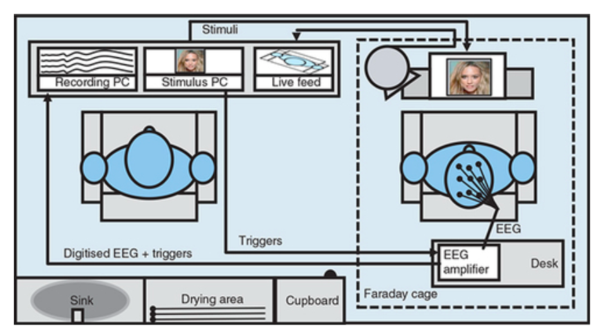

<br>

Two areas are demonstrated on the plot, One is called operational area by me and a Faraday's cage where participant seats in. The Faraday cage is a shield from electric interference, sound, and light from outside. It's expensive and complex to install. To communicate with participant in the cage during experiment, Spapé also mentioned camera and microphone (live-feed system, but the EEG lab in lund seems just a tiny window, 23333).

The chair in the Faraday cage should be comfortable but avoid being too comfortable (making participant sleepy). Head-rest isn't recommended while the arm- and leg-rest is useful (for this part, I will keep in mind that I should ask people don't tap leg during the experiment).

The monitor (Spapé mentioned CRT screen) in the Faraday cage should has high resolution and refresh rate, and also large enough size. The **stimulus PC** need to have good video card, audio interface and SSD hard disk (don't forget the **parallel port**, namely DB-25 port). Furthermore, the background software that is <font color = 'red'>**unnecessary**</font> on the stimulus PC need to be as fewer as possible to keep the lab PC in safety and in good state of timing performance. For **recording PC**, what we need is avoiding it into sleep mod to write time-stamped data and getting it a large enough disk to store data. To summary:

1. the stimulus PC is connected with participants' screen and input devices

2. the stimulus PC is connected with amplifier to send trigger that aligning with EEG signal

3. the amplifier having a separate power is connected with recording PC

## EEG software

### Setting up software

The EEG software on the recording PC is actually retrieving the time-stamped signal (with marker) from the short duration buffer of amplifier and save it in the disk. Another usage of EEG software is to help monitor the quality of data simultaneously.

Every electrodes are essentially same except their number for the software. First of all we must define the location of each electrode. Specifically, aligning the electrode number with 10/10 (dense) or 10/20 (sparse) positioning system, which uses 4 landmark of nasion, inion, left tragus (pre-auriticular), and right tragus (pre-auriticular) to identify the position on the scalp.

the 10/10 and 10/20 system Define the middle line point between left and right tragus as the 0 (zero), which is where the z in the Cz, Fz, Pz comes from. The even electrode such C1, FC1, and P3 is on the left side while the odd electrode is on the right side. From nasion to inion, we get pre-frontal(Fp), between anterior-frontal(AF), frontal(F), between frontal and central (FC), between central and parietal (CP), parietal-occipital (PO), and occipital (O). The electrodes with number greater than 6 are described by adding temporal onto the name of FC7+, C7+, and CP7+ (e.g., FT7+, T7+, TP7+).

### Example of ActiView and BrainVision

The matching relation between electrode number and the location number can be determined by configuration file that is changable. I remember the equipment in Lund memory lab uses a special electrode measuring the EOG, and I guess this was set in the configuration by Inês or other member, linking electrode 64 to EOG.

Biosemi's ActiView applies **<font color = 'red'>decimation algorithm</font>**, meaning it would disposes $\frac{3}{4}$ amount of collected signal. For example, with a sample rate of 4000 Hz, only 1000 Hz of data trigger will be stored. **Spapé advised that store data at close to 1000 Hz**.

During the data collection, the filter contains **<font color = 'red'>high-pass (Low-cut)</font>** and **<font color = 'red'>low-pass (high-cut)</font>** filters. The former one involves in removing drift and fuzzy noise to make the signal stable. filters in the data collection will affects the stored data therefore Spapé suggested only set a high-pass filter of $\approx$ 0.01 Hz would be fine. Because the same filter still can be applied afterwards. I'd like to call this ***Preserving Principle***. Apart from that, for monitoring without saving filtered data, the software in the book have a function called ***display filters***, having similar setting interface. Also, there are  frequency bond filter removing certain frequency (e.g., line frequency, 电源工频) and notch filter preserving/keeping certain frequency.

> "Once the triggers are shown in the recording software, you can be certain that
everything is connected. Which means it’s time to think about getting some real
participants."

# Ch6 EEG equipment & dealing with people

<font face = 'Zapfino' color = 'blue'>I think I at least have some experience with this topic since I have been in the memory lab for a semester to help.</font>

(⁎⁍̴̛ᴗ⁍̴̛⁎)

Making participants trust you and glad to follow your instruction rather than being distracted by other irrelevant stuffs during the experiment. Pretend to be a people person.

## Preparing for participants

### Ethics

Before start the experiment involving human participants, an approving statement from some ethical board/committee (In Sweden it's ***Swedish Ethical Review Authority***) is necessary. Asking the local ethical board in advance may help.

#### Safety

Although in the most cases, we won't boring pain to the participants, still there are many minor aspects needed to be considered. As a researcher, we should think how these risks be caused and how to alleviate them. For instance, the allergy and bacterial/viral infection come from material such as EEG gel and alcohol. The influence of the emotional stimulus.

#### Transparency

Simply speaking, it's about deceiving your participants. It isn't to tell participants everything possible, but is to let subjects know some general aspects that have potential risks and to leave the informed choice on their participation.

#### Voluntary participation

It contains 2 sides: 1) The participants shouldn't feel forced (pressure and misinformation) to join the experiment. 2) The participants have right to quit at any point of the research without feeling fear or negative consequence. Participants keep the right to withdraw their previous consent. Besides, Spapé also suggested to give withdrawing participant full reward.

For the half-finished data of withdrawing participant, asking them whether they want to withdraw these data as well. One way to delete data of certain people while implementing the anonymity is to code them using the last 4 number of their phone. However, this pseudonymous (化名的) method involves affair that needed to be discussed with local ethical board.

#### Sensitive data

Basically, it's almost impossible to recognize one person by their EEG data. Spapé still advised to minimize the use of personal label onto the data such as name and birthday to avoid leaking. Another issue is how to keep balance between data-protection and open data.

### Screening

1. Handedness, just report it honestly or exclude left handed people or balance left and right handed people

2. Healthy, exclude people with psychological or neurological disorder in recruitment may be rational

### Recruitment

3-stage approach was introduced to avoid participant's disappear/absence

1. Creating flyers that describes the research in a more excited and attractive way than it actually is. Don't forget to leave information including a decent **payment**, the **time needed** for experiment, the NB **goal** (for the science!), and the **contact email** on the flyers. A good short flyer is better than a long explanation.

2. Sending replies to the potential participants who contact you by the email on the flyers. The content of replies should contains a **quick explanation** of the experiment (2 sentences), the **goal of your research** (1 sentence), and the **task for them** (1 sentence). All these above can use copy-paste from a prepared template but it's good to treat people individually. On the top of that, attaching **full instruction and consent inform** is also good but don't need to require them do anything with the attached files, neither reading that. In the reply email, mention what's the neurological or psychological disorder for exclusion criteria (e.g., "Not using any psychopharmaceutical or neurological medicine, nor having any diagnosis commonly associated with such medicines"). Also telling them that exclusion criteria only applies to recent occurrence but not thing years ago. Other relevant issue can also be mentioned (e.g., highly dense hair and beard).

3. After negotiating a suitable time for experiment, give participants your **phone number** in case of sudden cancel (or just exchange phone number). you can also suggest them to tell you one day before the experiment if they want to quit if possible. Also, sending a **reminder** before the experiment. It can have some tips like "wash hair and don't use make-up to increase the contact between electrodes and skin".

### Preparing lab materials

Stuffs before the arrival of participants:

- Recording software

- Forms

- EEG cap with placed electrodes

- Electrolyte gel and alcohol

- Stickers, syringes, cotton swabs, towels, tooth brush, and measure tape

- Snacks?

## Running the experiment

Emmmm, in summary, make your participants happy but not soooo happy during capping them.

### Setting up

This section is about head measuring. One tip is that choosing a slightly tight cap is recommended. We can also apply water mister to avoid static charge in some regions with dry climate.

### Steps to start recording EEG

1. Put the cap onto the participants and ask them to fasten it by themselves. Additionally, don't forget the calibrate and adjust it after that. The details see the handbook of Lund memory lab.

2. This step is about placing the electrodes on the electrode holes. But Lund EEG lab seems do it in advance.

3. This step is about injecting EEG gel between scalp and electrodes while avoid electrolyte bridge. Explaining to the participants why you do so and asking how they're feeling. The details see the handbook of Lund memory lab.

4. Check the impedance (For passive electrode) and monitor data. However Linn never open impedance topographic interface and I don't know why (forgive me Linn, I now understand after reading few lines of textbook). Spapé suggested to use the **threshold of 10 k$\Omega$** in the end (electrodes below this will turn into green from red on the impedance topography). <u>Active electrode systems cannot easily provide impedance measurements</u>. Therefore, check whether the value is within **between -50 $\mu$V and 50 $\mu$V** to make sure the active electrode is well connected.

5. In case of bad connection, redo the EEG gel blablabla until the impedance or the value becoming normal. <font color = 'red'>NOTE: the draft or problematic spike of **multiple line** may indicate the bad connection of **reference electrode**</font>.

6. Repeat the check the revision until you can't improve anymore or too much time has been spent.

### Recording other signals

- Electro**oculo**graphy (眼电图).

- Electro**cardio**graphy (心电图).

- Electro**myo**graphy (肌电图).

- Electrodermal activity ((皮肤电).

Although the mastoid has been used as a classical reference site for long, it's also good to re-calculate signal **afterwards** using data recorded in site such as mastoid and nose tip. This is called "offline re-reference" instead of set mastoid electrode as the reference directly during ongoing recording.

### Recording data

Before formally starting the experiment, show participant the monitor of recording PC and conduct few tests below:

1. Calm EEG signal down first and explain how sensitive EEG is, to the movement and other activities.

2. Show participant the EEG signal caused by their vertical and horizontal eye-movement, as well as that evoked by blinks. Then explain they need to stare at the center of the screen and to blink at the interval between trials.

3. Exhibit the noise triggered by muscle such as smile and frowning to the participant. Then we can ask people try keeping still during the experiment.

4. Ask people to close eyes and wonder for a while, and indicate the $\alpha$ wave to them, explaining this means being out of concentration. Tell people feel free to take break and have a coffee when they need to. $\alpha$ wave is a strong source of noise and can't be removed afterwards.

Press the button and make sure that the software is actually recording. After that open the experiment file on the stimulus PC and run the experiment. During the experiment, we need to monitor the screen time to time (e.g., 1 time per minute). The periodic artifacts are often caused by repetitive movement such as chewing, leg-swinging, and nodding. A sudden noise may evoked by a cough or other things. Too many $\alpha$ waves indicate that perhaps it's time to have a short rest. A flat line means a dead electrode and we should drop this one in the analysis.

### Washing up

I have been a master of washing EEG cap already (NB). “Washing up takes about 15 minutes of actual, manual labour”.

Spapé also suggested to debrief participant on the design of the study if they are interested and copy your data away.

# Ch7 EEG pre-processing

## Getting started

### Starting MATLAB

The basic elements of `MATLAB` interface are similar to that of `R`.

```{MATLAB Ch7_setup, eval = F}
# add a variable with printing out
a = '10'

# add a variable without printing out
a = '10';

# check a variable
# the function disp() in MATLAB is equivalent with print() in other language
disp(a)


# generate a magic matrix of 5 by 5
# the sum of each column in a magic matrix is equal with other column
a = magic(5)

# you can also visualize such matrix
# but where is the legend and label of the plot???
a = magic(99);
imagesc(a);
```

The MATLAB is matrix-based, which is consistent with our EEG data: **<font color = 'red'>every channel serving as a row while every time point are denoted as a column</font>**.

### Starting EEGLAB

To add `EEGLAB` into MATLAB's toolbox, we need to add the folder directory of downloaded EEGLAB, not with subfolders.

```{MATLAB Ch7_open_EEGLAB, eval = F}
# enter the command below to initiate EEGLAB
eeglab
```

### Setting up

1. <font color = 'red'>Enable option of "If set, show all menu items from previous EEGLAB
versions" in the `File > Preferance` of EEGLAB</font>.

2. Download the dataset of this tutorial from [this website](https://study.sagepub.com/Spape "click it").

3. The recorded data should contains markers, headers, and actual data files. These files sometime are saved separately (`.vmrk`, `.vhdr`, and `.eeg`) by EEG software, and sometime are combined together into one.

## A first look at data in EEGLAB

In case of closing EEGLAB window accidentally, type command `eeglab redraw` helps re-open the window without overwriting stored data.

### Importing (header) data

Although EEGLAB use `.AFAIK` format to store EEG data, the multiple EEG manufacturers use various kinds of data type. Therefore we need to apply some plugin enabling EEGLAB to read their files and to import data (of course, install them beforehand by google the name or keyword of certain plugin i.e., "EEGLAB plugin .vhdr file" for current example). If you not sure about what plugin is required, asking colleague or amplifier's manufacturer.

Then follow `EEGLAB > File > Import data > Using EEGLAB functions and plugins > From Brain Vis. REc. vhdr file` for current tutorial. Two consecutive dialogue shows up after a `.hdr` file being selected. According to the tutorial, segmenting the imported data in the first dislogue helps little for operation speed so we can just import all data point from all channels, namely leaving the input blank.

The data will be imported as a **<font color = 'red'>dataset</font>** in the EEGLAB. For now we just focus on how to name it properly.

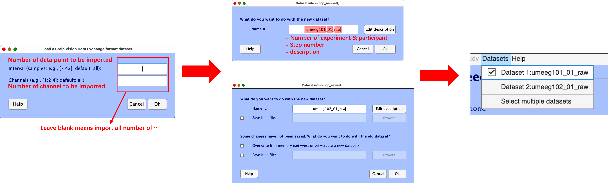

<br>

### Resampling

Resampling is a method to change the temporal resolution of the dataset to reduce the size of data and to make data collected from different equipment comparable. For example, Assume here are 2 EEG equipment companies: A and B. The former one produces amplifier A with sample rate of 1000 and the latter one produces amplifier B with sample rate of 1024. Thus, data from this two amplifiers have different number of timepoint within a given period, making them hard to be compared/matched precisely, further making average across participants difficult (need data with same length). If your computer is powerful enough and you collect data with the same device, the resampling isn't all necessary. For current tutorial, to align 1000 and 1024, Spapé resampled all dataset to 512 Hz.

还有一个重采样的原因是，Nyquist采样定理认为，采样率必须在感兴趣频率的2倍以上，最多3-4倍。而脑电至少ERP分析最多也就到40赫兹，所以按理来说160赫兹真的够，可以节省算力和计算时间。

`Select the target dataset > Tools > Change sampling rate > Set a new sampling rate`.

Then we can rename resampled data with new name such as `umeeg101_02_resampled` by clicking `Edit > Dataset info`.

### Editing channel locations

This step is to tell the EEGLAB how to relate the channels in the data to the actual locations. 3 conditions were mentioned in this book.The point is to check whether labels for each channel are correct and revise/rename them if something wrong (e.g., eye-movement electrode).

1. Use default locations that has already been shown by EEG software (`umeeg101`): `Edit > Channel locations`

2. Use default locations and forgot naming them in the EEG software (`umeeg102`): Find and prepare the **<font color = 'red'>configuration file</font>** of channel-electrode relation (for BrainView it's `.cfg`). After `Edit > Channel locations`, rename the label (<u>capitalization matters</u>!) by configuration file for each channel manually. Then, click `Loop up locs` and `Save (as .ced)` to generate the location file. By doing so, we don't need to do the revision anymore but reuse that `.ced` file.

3. Didn't use 10-10 or 10-20 system at all: Although configuration file and localization file may help, you'd better resort to the company for asistance.

finally, don't forget to save data (e.g., `umeeg101_03_channels_located`).

### Scrolling through the data

Click `Plot > Channel data (scroll)` to have a overall see on the resampled data.

## Removing bad data

### Removing bad times

Normally we will record EEG within a period that beyond the duration of the experiment. Namely the very beginning and ending of the data are almost useless. According to Spapé, we can through away data 20 seconds before the first marker and away data 20 seconds after the last marker (trimming).

For `umg101`, the first marker emerged at 33 second and the last marker appeared at 1992 second. So what we should remain is timepoints between $[13, 2012]$. The operation follows: `Edit > Select data > Enter the target time interval > OK`. Again, rename the data and decide whether overwriting the old dataset.

时删的时候，不要碰有marker的时间段，真不行就删除一整个loop/block，假如一段咳嗽确实不想要。

### Removing bad channels

Once an electrode died or somehow didn't work anymore, we should take note of it on the lab diary and drop bed channel during analysis. For example, in the `umeeg102_03_located`, AF7 and FPz are always flat, meaning their're likely to be dead. So we should remove these two channels. `Edit > Select data > Select channels we want to remove and target period`.

## RE-referencing data

<font color = 'red'>不管什么时候，我们所测量到的EEG信号总是相对于某一个参考点的，不管那个点位于哪</font>。

### Practical theory

Ideally, the potential of the reference electrode should be constant and provides a baseline for others. However, due to some reasons, this potential can also share some similarity with electrodes of interest, making us confused whether the observed potential is exactly positive or not. To increase the reliability of our reference, we apply re-reference onto the data, namely re-calculate the potential **<font color = 'red'>as relative to</font>** other site (e.g., mastoid, nose tip...).

- Common channel re-reference: find **a** new channel to serve as the reference. Normally it's a bony part less sensitive to brain activities. This method is classical and is used for replicating the earlier work that used same re-reference site.

- Common average re-reference: Calculate the average value of potentials over all target channels, and subtract this value from each channel. In this way, the sum of all channels should be **0**. A good average re-reference tends to show less noise but it's affected by bad channels. Additionally, this method may have weak temportal resolution compared to channel re-reference.

### Re-reference in EEGLAB

`Tools > Re-reference the data` in EEGLAB

**<font color = 'red'>This step should be done after dropping the bad channels</font>**. Moreover, enter the electrodes that outside the 10-20 and 10-10 system as "`exclude channel indices`" (e.g., HEOG and VEOG). Again, save the data with good and practial name.

Biosemi amplifier is little bit special as it has no real "reference electrode" but a special algorithm (CMS-DRL). This results in difficulty of dropping bad data, which should be done before re-reference, because all data collected by Biosemi amplifier looks pretty auwful before re-reference. One way to solve this is re-reference by Cz or Pz **<font color = 'red'>temporarily</font>** -> inspect timepoints and channel -> formal re-reference after inspection.
 
However removing channels also brings problem. The average value without bad channels is biased compared to that it should be or that in the literature. This problem becomes worse with increasing number of removed channels. Therefore, **interpolating** bad channels may compensate (see figure 7.2 as below). However interpolation at this stage **<font color = 'red'>isn't recommended</font>** by the textbook.

`Tools > Interpolate elelctrodes > Select from channels`

> "That said, if you fear a bias has crept in, you can always re-reference your data at any later point in the processing pipeline."

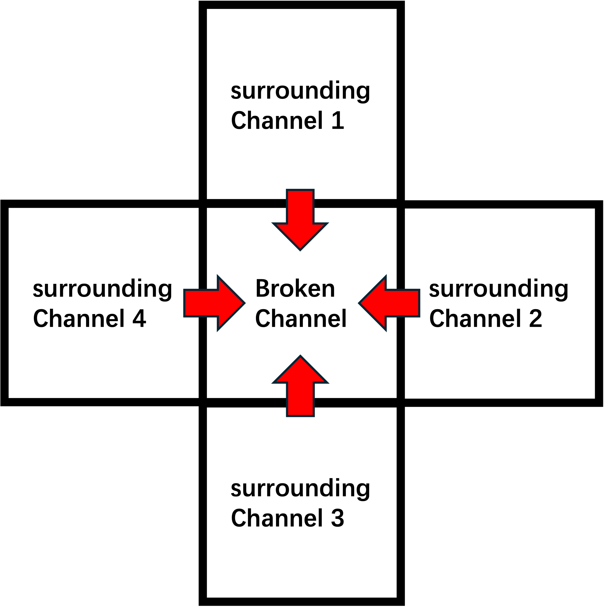{width="7.5cm"}

<br>

## Filters

Informal reminder: high pass for filtering drift and low pass for reducing the spiking line.

### Different filter

`Tools > Filter the data > Basic FIR filter`

As the first graph in the middle part of figure 7.3 shows, we apply a bandpass filter allowing the frequency within certain limits to pass or to be kept. Apart from that, we can also apply a notch filter that removes **<font color = 'red'>line power interference (工频干扰, 50 Hz in China and EU, 60 Hz in US and Japan)</font>**. Actually that's a special bondpass that enables the option "`Notch filter`".

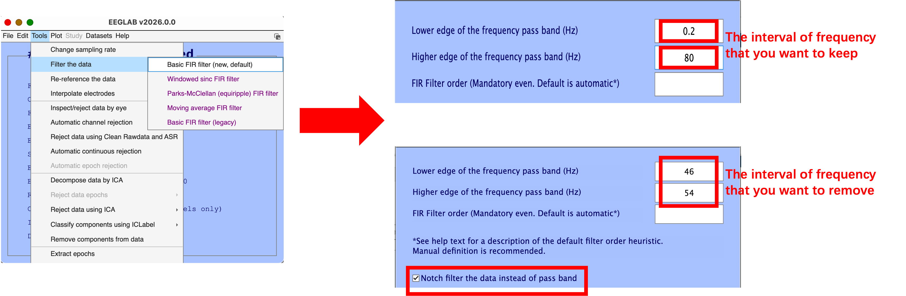

<br>

> "Filtering does a lot, but it can’t turn bad data into good data."

### Using and over-using filters

Administering the filter affects the shape of EEG components. For example, adding a high pass filter would reduce the faster components (e.g., P1) and a low pass filter may attenuate the slow components (e.g., P3).Additionally, the filter also distorts the data.

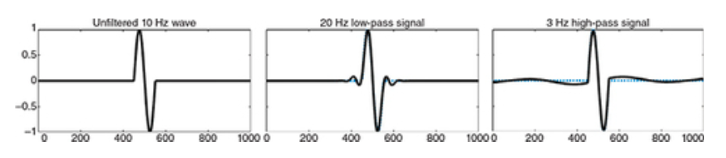

<br>

The filter can't 100% remove the artifact evoked by eye blink or muscle, which influence a wide range of frequency, even through we apply a high- and low-pass filter. But to a optimistic side, Even if we obtain a very angry signal for a real potential that is actually a smooth line, we are able to approach the real value by averaging the recorded signal across each timepoints. In the practice, we often don't use notch filter on the line power interference since there is already a Faraday cage.

```{r Ch7_import_package, include=FALSE}
library(tidyverse)
```

```{r Ch7_average_signal, echo=FALSE}
time_point <- seq(0, 1, length.out = 1000)

real_sig <- -4 * time_point^2 + 4 * time_point

set.seed = 114514
noise <- rnorm(length(time_point), mean = 0, sd = 0.5)
recorded_sig <- real_sig + noise

df_ch7 <- tibble(time_point, real_sig, recorded_sig) %>% 
  pivot_longer(cols = c(real_sig, recorded_sig), 
               names_to = 'type', 
               values_to = 'values') %>% 
  mutate(type = factor(type)) %>% 
  mutate(type = fct_relevel(type, 'recorded_sig', 'real_sig'))

ggplot(data = df_ch7) + 
  geom_line(aes(x = time_point, y = values, 
                color = type, linetype = type, 
                alpha = type)) + 
  scale_color_manual(values = c('real_sig' = 'black', 
                                'recorded_sig' = 'blue'), 
                     labels = c('real_sig' = 'Real signal, \nwith mean value = 0.67', 
                                'recorded_sig' = 'Recorded signal, \nwith mean value = 0.66')) + 
  scale_linetype_manual(values = c('real_sig' = 'longdash', 
                                   'recorded_sig' = 'solid'), 
                        labels = c('real_sig' = 'Real signal, \nwith mean value = 0.67', 
                                'recorded_sig' = 'Recorded signal, \nwith mean value = 0.66')) + 
  scale_alpha_manual(values = c('real_sig' = 1, 
                                'recorded_sig' = 0.6), 
                     labels = c('real_sig' = 'Real signal, \nwith mean value = 0.67', 
                                'recorded_sig' = 'Recorded signal, \nwith mean value = 0.66')) + 
  geom_hline(yintercept = 1, color = 'red', linewidth = 0.5)
```

## The exercise of Ch7

### Additional exercise 1

```{MATLAB Ch7_convset_into_code, eval = F}
# Click click click in the EEGLAB GUI
# Then enter below, eeglab will return the code:
eegh

# Then eliminate the code relevant to GUI
# leave as below
eeglab
EEG = pop_loadbv('.', 'umeeg101.vhdr');
EEG = pop_resample(EEG, 512);
EEG = pop_select(EEG, 'time', [13, 2012]);
EEG = pop_reref(EEG, [], 'exclude', [33, 34]);
EEG = pop_eegfiltnew(EEG, 'locutoff', 0.2, 'hicutoff', 80);
EEG = pop_eegfiltnew(EEG, 'locutoff', 46, 'hicutoff', 54, 'revfilt', 1);
pop_saveset(EEG, 'filename', 'data_for_code_exercise.set', 'filepath', '.')
# 我靠matlab语法怎么看起来和有病一样。。。它们参数不是靠赋值竟然
```

How to run same filter on 3 different files?

```{MATLAB CH7_batch_first_time, eval = F}
# first prepare a list containing all names of target file
file_list = {'file1.set', 'file2.set', 'file3.set'}
name_for_save = {'file1_filt.set', 'file2_filt.set', 'file3_filt.set'}

# then do a for loop
# 第一，matlab用()索引元素
# 第二，eeglab的参数赋值像一坨屎
for current_file = 1:length(file_list)
    # here write your operation
    EEG = pop_loadbv('.', file_list{current_file});
    EEG = pop_eegfiltnew(EEG, 'locutoff', 0.2, 'hicutoff', 80);
    pop_saveset(EEG, 'filename', name_for_save(current_file), 'filepath', '.')
end
```

Although the code above is a prototype for batch-like processing, we still need to give it some adjustments when in the **<font color = 'red'>real practice</font>**.

### Additional exercise 2

This seems relevant to how to plot basic figure for EEG data.

```{MATLAB Ch7_plot_data, eval = F}
# first create a simulated signal data
sim_sig = zeros(1, 10000);

# create some changes in the signal
sim_sig(4951:5000) = -1
sim_sig(5001:5050) = 1

# apply a filter on the simulated signal
# however, this has been illegal in 2026, therefore I fail to follow the tutorial
# sim_sig = pop_eegfiltnew(sim_sig, 'hicutoff', 20)

# finally plot it
plot(sim_sig)
```

# Ch8 Further pre-processing of EEG

## Epochs & baseline

Epoching/segmenting is to cut a continuous EEG data into epochs or segments by events. This helps us reveal the effect pattern caused by different experimental conditions and remove bad epochs while keeping good epochs alone.

Then the book retell the philosophy of ERP: averaging the signals across stimuli makes effect of event remained and neutralizes the random noise. This is a formal eidition of Xiaoming's story (小明小明). A signal consistently occurs raletive to the onset of certain stimlulus is called **<font color = 'red'>time locked</font>**. Then we will Compare the signals with the baseline (the timepoints within a period occurring 0 ms before the stimulus onset).

### Epoching in eeglab

The practice of epoching in the eeglab is much easier than the theory underlying it. Two critical information are required for this step:

- The time stamp of time-locked event (When it occurs?) -> The marker tells
- The duration of these events (How long it lasts?) -> Define it by youself

An epoch shouldn't to be longer than duration of the brain signal that it contains. To inplement it in the eeglab, click `Tools > Extract epochs`.

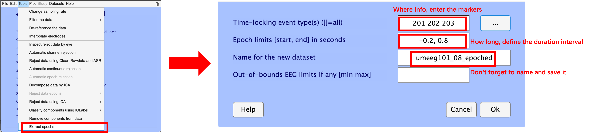

<br>

### Baseline correcting

This step is subtracting the mean value of baseline from other timepoints in the epoch. In other words, assuming $x$ denotes the value of signal, it's 

\begin{align}
t &\in [-0.2, 1] \\
\text{baseline} &= \frac{1}{n} \cdot \sum \limits_{t = -0.2}^0 x (t) \\
x_{processed} &= x_{t} - \text{baseline}
\end{align}

Thus, the meaning of "baseline removal" is to make the data points within [-0.2, 0] $\approx$ 0 (what's "baseline" otherwise), and to remove baseline value out of every data points. Luckily eeglab can recognize the target time interval as the baseline, automatically.

However, here is a annoying problem: if you really use the prepared number by eeglab, you would get into the error. My solution is replacing the specific default number of lower limit with `EEG.xmin` as figure 8.2 demonstrated. Besides, this is also good for code pipeline in our later study.

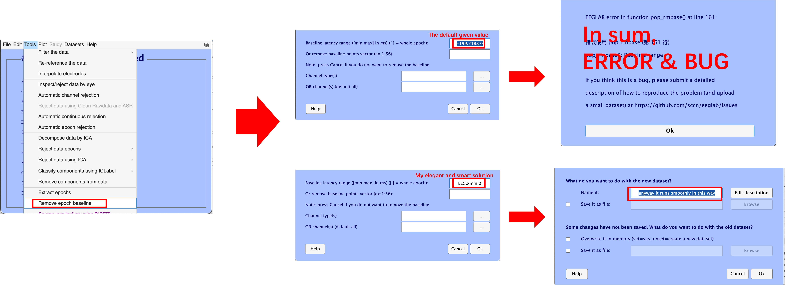

<br>

## Artifacts

> "In many ways, doing EEG research is a bit like studying bird song with a few cheap microphones planted in a grassy field between a motorway and an outdoor dance music festival taking place despite an ongoing earthquake."

According to the textbook, recorded EEG signal is comprised by 8 kinds of components

1. Targeted mental/cognitive process.

2. Other brain signals (e.g., moto-sensory precossing).

3. $\alpha$ waves which is so strong and so easy to be generated that even without modern equipment it's not hard to be noticed.

4. Eve-movement, usually large size in the frontal area, around 50 $\mu$V.

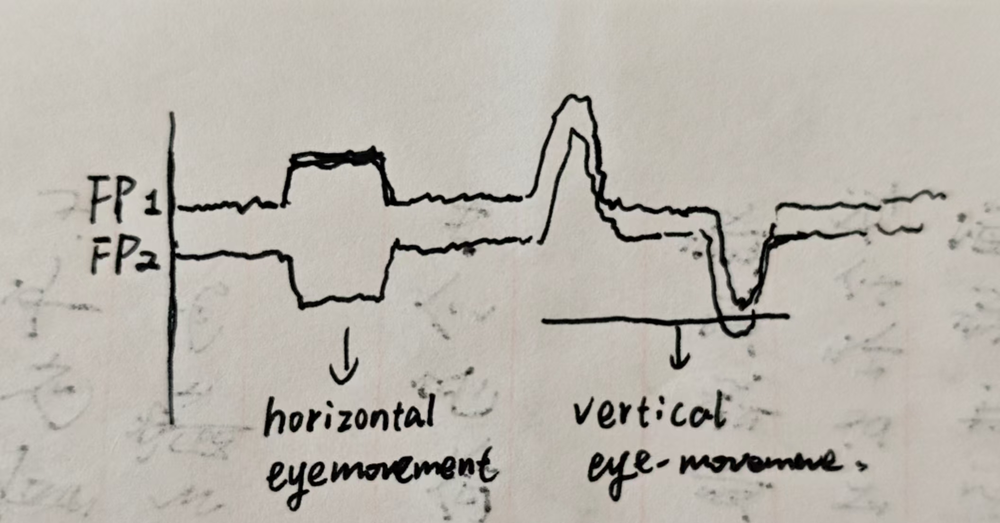

<br>

5. Eye-blink artifacts. Typically occurs every 5 s.

6. Blood pumping when the cap is too tight. Random muscle twitches (颤动), frowning, chewing, swinging feet, tapping legs, and coughing (it's the worst).

7. Non-conductive pollutants between scalp and electrodes

8. Line noise comes from the frequency of power network (50 Hz in China and EU, 60 Hz in US and Japan)

Although the averaging method helps shrink the irrelevant noise and remain the signal of interest, including an epoch with a very strong artifact would reduce the efficacy of our averaging. Therefore removing noisy epochs before averaging, a way to throw the contaminated data away completely, is classical and necessary (**<font color = 'red'>artifact rejection</font>**). Another way is to "repair" the noisy data and reduce the proportion of artifact as much as possible (**<font color = 'red'>artifact correction</font>**).

Emmmm during the practice at the later stage, I think it would be helpful if the normal amplitude corresponding to each kind of artifact is given.

|type|normal Voltage|
|---|---|
|eye-blink|100 - 300 $\mu$V|
|strong eye-blink|300 - 500 $\mu$V|
|vertical eye-movement|40 - 80 $\mu$V|
|saccade|20 - 60 $\mu$V|
|large saccade|60 - 100 $\mu$V|
|$\alpha$ wave open eye resting state|20 - 60 $\mu$V|
|$\alpha$ wave task state|10 - 20 $\mu$V|
|$\alpha$ wave close eye|60 - 100 $\mu$V|

artifact rejection -> artifact correction -> artifact rejection.

A dead man will never re-alive, the bad data would never be recovered, no matter how prefect and optimal an artifact correction technique is.

### Artifact rejection #1

$\alpha$是平原变丘陵，`FC`和`Cz`快速查看。眨眼大海浪，F字头看。稍有运动全套乱，疯狗浪。

To be honest, my eyes have died after trying to inspect the data by naked eyes in the plotted scroll data. Luckily, the first roll of artifact rejection seems quite simple in the eeglab: `Tools > Reject data epochs > Rejct extreme values`. Just use the default value provided by the dialogue as shown in the figure 8.4. However, we need to change the rejection threshold to a very huge value like $\pm$ 1500. IF it doesn't work or doesn't reject any bad epochs, change the threshold to $\pm$ 200 and run again.

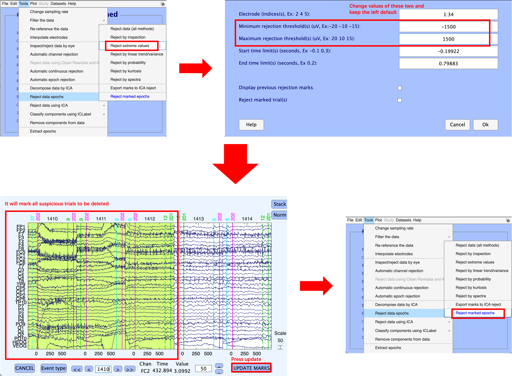

<br>

Spapé suggested that really there are 1% epochs that will be unsalvageable (无法挽救). After updating markers in the jump-out plot, we need to delete these marked bad epochs/trials in `Tools > Reject data epochs > Reject marked epochs`.

### Artifact correction

This step is to remove a known and unwanted component from a soup containing other multiple unknown ingredients, further to reduce the proportion of the noise and make the signal "clear" enough based on our some assumption.

One classical method applies <u>linear regression</u>. This technique requires the HEOG and VEOG signals, and calculate the correlation between signals form other channels and EOG. Then it rejects correlation part and keeps the residuals. In other words, it assume the components correlates with EOG in the EEG signal is caused by eye-movement (developed by Gratton, et al., 1983). The `eeglab-gratton-master` plugin is required for this method, and can be downloaded [here](https://github.com/ihrke/eeglab-gratton/ 'click it'). Although Spapé said we can just use the default values, it seems to run into the error again. For this time I fail to fix it up. I will do the artifact correction by ICA, which is more modern and more powerful. Spapé also provided a initial tutorial of ICA in the exercise section.

`Tools > Ocular Correlation (Gratton)`

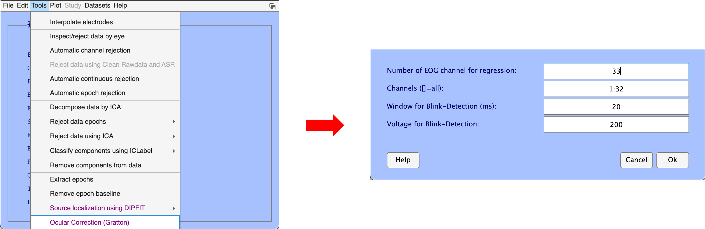

### ICA based artifact correction

#### My attemption to understand

Although I didn't learn linear algebra formally... Assuming we are calling Lena or Linn using our wonderful Xiaomi 15, which has maybe 2 microphone to pick up the voice. It's pity that Lena or Linn fail to hear us due to the noise on the street and due to the whisper of phone elves. So let's say two microphone picks up both our speech and the street noise and mixes them together. However, note that because these two microphones have different locations (one is inside and another is outside), so they also pick up noises from different sources with varying weight (e.g., street noise contributes more to the outside microphone while the phone elves' whisper contributes more to the inside microphone). All sources are **<font color = 'red'>independent</font>** from each other.

||time 1|time 2|time 3|
|---|---|---|---|
|microphone inside|mixed voice 1|mixed voice 2|mixed voice 3|
|microphone outside|mixed voice 1|mixed voice 2|mixed voice 3|

To demonstrate, I create a table above. Here we just assume the recorded voice is the result of **<font color = 'red'>linear combination</font>** by speech, street noise, and (maybe) phone elves. Then to obtain a clear signal of our speech, we apply ***independent component analysis (ICA)*** onto the table/matrix above, which decomposed into separated components:

||time 1|time 2|time 3|
|---|---|---|---|
|IC 1 (source 1, maybe our speech)|value 1|value 2|value 3|
|IC 2 (source 2, maybe street noise)|value 1|value 2|value 3|
|IC 2 (source 2, maybe phone elves)|value 1|value 2|value 3|

So, that's ICA did: "maximise the degree to which components are
independent from one another -- Spapé". Back to EEG data, this technique helps us separate possible contributors out of each channel's recorded signal. Apart from that, ICA also helps to localize the brain signal and we need to make ICA decompositions comparable, said by Spapé. Here is why we can use ICA:

1. Recorded EEG signal contains both brain activities of interest and various artifacts.

2. Artifacts normally are independent from real brain signal in time and locations.

$$
EEG = A \cdot S
$$

所以ICA就是假设本来存在一个S矩阵（行：成分，列：时间），表示每个独立成分的时间序列，然后通过A矩阵（行：电极，列：成分），mixing matrix投射到不同的电极上，组成了我们所测量到的EEG数据。A矩阵表示了每个电极上每个成分的权重。

#### Implement ICA in eeglab

According to Spapé, ICA is best applied after <u>removing the baseline again within the range of whole epoch instead of [-0.2, 0]</u>. `Tools > Depose data using ICA`. We can just use all default parameters and run ICA that is time-costly. Moreover, if you interpolated `n` out of `m` channels, you need to enter `'extended', 1, 'pca', m - n` in the `Commandline options`.

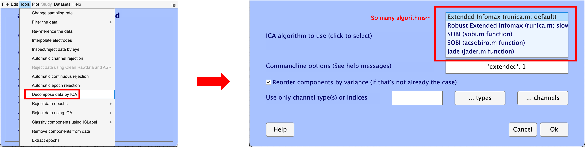

<br>

Click `Tools > Classify components using ICLabel > Label components` to check the overview of all components, all parameters are default values. Additionally, The signal processing toolbox is required by this step Install it in the MATLAB `Add-Ons` tab, if you haven't import it yet.

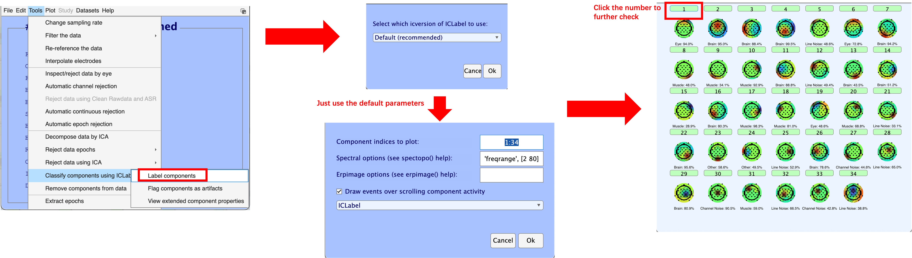

<br>

Although ICLabel provides some indicators about how possible each plot is related to which kind of source, Spapé suggested don't totally rely on that. We need to click any number above the topography to manually and carefully check the components, following the rules below (P.S. you can also mark the components by `Tools > Reject data using ICA > Reject component by map`, without ICLabel):

1. These topographies are arranged by their variance accounted for.

2. Some independent components shows typical shape on the topography such as the HEOG and VEOG, which is at the frontal regions with steep/rough (陡峭的) landscape.

3. A typical pattern difference between EEG and EOG spectrum is the **<font color = 'red'>bump</font> (a local spike)** at around 10 Hz. The muscle artifact normally has greater power spectrum at the higher frequency bands.

\begin{align}
\text{Volage} &= \mu V \\
\text{Power} &= {\mu V}^2 \\
\text{Power spectrum} &= {\mu V}^2/Hz
\end{align}

4. The average trial-by-trial plot sometime provides additional but peripheral evidence: brain-based component should reflect event-related feature.

After inspecting each topographies and their details, write down which you are sure bad or good and which you are unsure but are certain contain no brain activities. Then click `Tools > Remove components from data` and enter the number of the components you aim to delete (don't forget to note them down). But for this part I may need further guide from professor. Anyway, before really delete the components, we can click `Plot single trials` or `Plot ERPs` (the former one seems more significant) to compare "before & after". Click "OK" if you are sure to reject components. At least this is the operation of ICA in the eeglab.

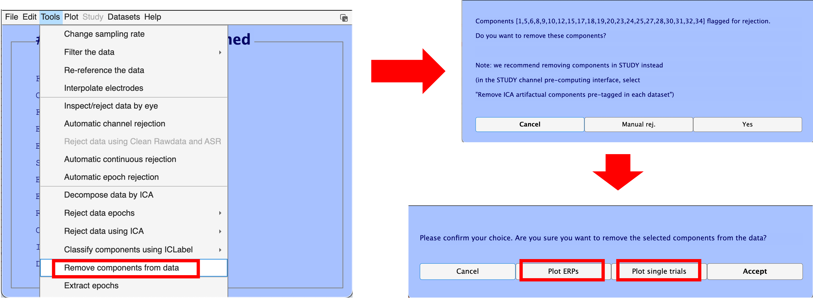

<br>

[好笔记](https://zhuanlan.zhihu.com/p/587549594 '知乎')

好吧果然还是需要我自己来补课tmd，不得不佩服那些人的学习能力，不过他们确实是有培训的来着而我没有。下面开始伪迹成分去除。还有就是**<font color = 'red'>红蓝颜色无所谓，主要是颜色的深浅才有意义</font>**

1. 垂直眼电伪迹识别
    - 前端分布能量高
    - 试次时域图能量小方块随机分布
    - 低频能量高
    - 成分占比排序靠前

2. 水平眼电伪迹识别
    - 前侧八字，红蓝相对
    - 试次时域图中红蓝交替长条随机分布
    - 低频能量高
    - 成分排序靠前，但一般在VEOG后面

3. 头动伪迹
    - 地形头周围分布
    - 试次时域图长条随机分布
    - 试次时域图单个trial中非常明显漂移
    
4. Line power interference
    - 50 Hz 能量巨勾巴大大大
    - 试次时域图单个trial粗得一批
    
5. 心电伪迹
    - 试次时域图色块分布跟莫奈一样
    
6. 肌电
    - 高频能量高？
    
然后这个[教程](https://www.bilibili.com/video/BV1EN411A7rh/?share_source=copy_web&vd_source=3dd26d6a4a504251ab779e59539f4a74 '这个洒家喜欢')说`ICLabel`一定tm要用，尤其是2016版前的。然后可以用[在线网站](https://labeling.ucsd.edu/labelfeedback '跟医生看片儿一样')练习自己判断伪迹的能力。ICA结果每一次不会完全一样，主要去掉眼电就很有用了。

Don't forget to recover the **<font color = 'red'>baseline</font>** and name the dataset before saving it.

### Artifact rejection #2

The criterion of the noise contributor differs across different labs and equipment. The textbook provided information combining the rule of thumb and general priceple. The point is how to remain data points as many as possible while cut out the noise as clean as possible.

1. If less than 5% of epochs are removed, the data would remain "unclean"

2. Artifact correction (I think Spapé here meant that classical method) can "erase" the artifact caused by eye-movement but can do little with that caused by frowning, body movements, and $\alpha$ noise.

3. An ideally conducted experiment without movement involved brings a data loss rate at about 5 - 20%. This would be the half as many if we use ICA correction.

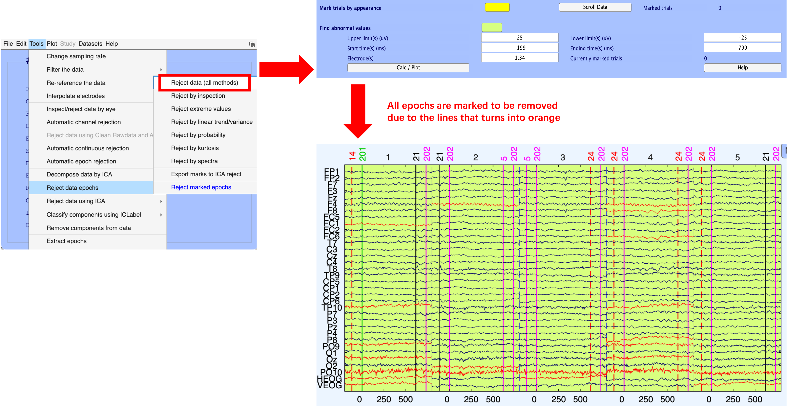

<br>

To do the second roll of artifact rejection, click `Tools > Reject epochs > Reject data (all methods)`. As figure 8.6 showing, almost all trials are colored due to the "abnormal values" in orange channels that located in the peripheral area of EEG cap, where deserving a more conservative threshold. Apart from that, Spapé also mentioned that this tutorial has the area of interest located in the roughly "central" region of the cap (maybe because P3 is generated by fronto-parietal area?).

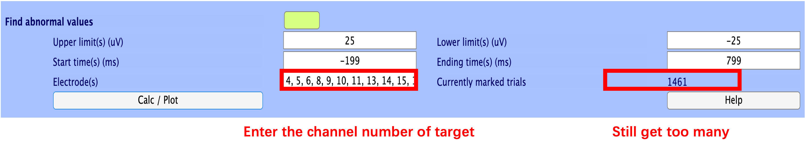

<br>

Therefore, we need to check the channel number of electrodes that is around the fronto-parietal region (F, FC, C, CP, P) and is not in the peripheral side of EEG cap (number is less than 7). Specifically, they're [4, 5, 6, 8, 9, 10, 11, 13, 14, 15, 18, 19, 20, 21, 24, 25, 26] for `umeeg101`. Then we just enter these number into the dialogue and keep other values default. Maybe we still get too many marked epochs to be removed (see figure 8.7). So what we will do is continuously adjusting the threshold of $[\pm100, \pm90, \pm80, \pm70, \pm60, \pm50, \pm40, \pm30, \pm20, \pm10]$ and applying that threshold onto those target channels.

```{r Ch8_the_second_rejection, echo=FALSE}
tibble(removed_epochs = c(0.01, 0.02, 0.03, 0.05, 0.08, 0.15, 0.27, 0.51, 0.93, 1), 
       absolute_threshold = c(100, 90, 80, 70, 60, 50, 40, 30, 20, 10)) %>% 
  ggplot() + 
    geom_point(aes(x = absolute_threshold, y = removed_epochs), 
               size = 5, shape = 1, color = 'blue') + 
    geom_line(aes(x = absolute_threshold, y = removed_epochs), 
              linewidth = 1, color = 'blue') + 
    geom_hline(yintercept = 0.2, linewidth = 1, linetype = 'dashed', 
               color = 'black') + 
    geom_hline(yintercept = 0.05, linewidth = 1, linetype = 'dashed', 
               color = 'red') + 
    geom_hline(yintercept = 0.35, linewidth = 1, linetype = 'dashed', 
               color = 'green') + 
    scale_x_continuous(breaks = seq(10, 100, 10)) + 
    scale_y_continuous(breaks = seq(0, 1, 0.1), 
                       labels = seq(0, 100, 10)) + 
    labs(y = '% removed epochs', 
         x = 'absolute threshold', 
         title = 'the black line = 20% remained, 
                  \nthe red line = 5% remained, 
                  \nthe green line = knee point')
```

By visualizing the relation between threshold and elimination rate, we **<font color = 'red'>seem</font>** to see the relatively optimal point (knee point) for the balance between keeping and cutting, to say, at the threshold of $\pm$ 35. Of course, the threshold corresponding to the 20% is still defensible (合理的). The tutorial chose the middle point between these two. Here we will do the same thing. Again, update the markers, and click `Tools > Reject data epochs > Reject marked epochs`.

Then we go through the similar operation for `Find abnormal trends`, `Find improbable data`, `Find abnormal distributions`. These method needs to be applied onto all 32 electrodes **<font color = red>except eye electrodes if you have</font>**. So, select target channels again and just leave other parameters default. Finally clear all marked epochs and **note down** exactly how many trials we deleted by each method. Note that it would take quite looooong time to calculate the marked epochs.

After steps above, we obtain a well pre-processed EEG data, and are ready for **<font color = red>REAL EEG ANALYSIS</font>**. To summary:

1. *Re-sampling*
2. *Localization*
3. *Trimming*
4. *Re-referencing*
5. *filter*
6. *Epoching*
7. *baseline removal*
8. *Artifact correction*
9. *Artifact rejection*

## Ch8's exercise about batch process

I will try by finish a pre-processing in the GUI and manage to transform it into a code pipeline, following the hints from Spapé.

```{MATLAB Ch8_batch_processing, eval = F}
% Assuming I intend to process `umeeg101` and `umeeg103`

data_file = {'umeeg101.vhdr', 'umeeg103.vhdr'}
data_save = {'umeeg101_filtered.set', 'umeeg103_filtered.set'}

for i = 1:length(data_file)
    % 加载数据
    EEG = pop_loadbv('.', data_file{i});
    % 重采样
    EEG = pop_resample(EEG, 512);

    % 节选，首先确定第一个和最后一个marker的时间
    first_marker = EEG.event(3).latency / EEG.srate;
    last_marker = EEG.event(end).latency / EEG.srate;
    EEG = pop_select( ...
        EEG, 'time', ...
        [first_marker - 20, last_marker + 20]);

    % 重新参考，留空的[]是平均重参考，要么你自己填写参考电极
    EEG = pop_reref(EEG, [], 'exclude', [33, 34]);

    % 滤波
    EEG = pop_eegfiltnew(EEG, 'hicutoff', 80, 'locutoff', 0.2);
    EEG = pop_eegfiltnew(EEG, 'hicutoff', 46, 'locutoff', 54, 'revfilt', 1);

    % 先存一下数据
    pop_saveset( ...
        EEG, ...
        'filename', data_save{i}, ...
        'filepath', '.');
end


% 其实如果被试号是连号，那么
% 直接用sprintf('umeeg10%d.vhdr', i)就能直接历遍了
% sprintf()和r的paste0()功能差不多
% 而不需要创建文件列表了
```

The code above is the batch script for pre-processing in the chapter 7, including: 

1. Load data
2. re-sample
3. select timepoints
4. re-reference
5. filter

Then we can add the steps in the chapter 8 into that pipeline. As Spapé mentioned, we may need to create a list variable to store components to be delete individually and try to figure out how to conduct the second roll of artifact rejection in the code.

```{MATLAB Ch8_whole_preprocess, eval = F}
protocol = {
    'umeeg101', '.vhdr';
    'umeeg103', '.vhdr';
};


%%
% 首先就是插值或者删除坏道之前的都能代码化
for i = 1:size(protocol, 1)

    % 加载数据
    EEG = pop_loadbv('.', [protocol{i, 1}, protocol{i, 2}]);
    
    % 重采样
    EEG = pop_resample(EEG, 512);

    % 节选，首先确定第一个和最后一个marker的时间
    % 但是我不知道何意味
    first_marker = EEG.event(3).latency / EEG.srate;
    last_marker = EEG.event(end).latency / EEG.srate;
    EEG = pop_select( EEG, ...
        'time', [first_marker - 20, last_marker + 20]);

    % 滤波
    EEG = pop_eegfiltnew(EEG, 'hicutoff', 80, 'locutoff', 0.2);
    EEG = pop_eegfiltnew(EEG, 'hicutoff', 46, 'locutoff', 54, 'revfilt', 1);

    % 分段和基线
    EEG = pop_epoch(EEG, {'201', '202', '203'}, [-0.2, 0.8]);
    EEG = pop_rmbase(EEG, [EEG.xmin, 0]);

    % 先存一下数据
    pop_saveset( ...
        EEG, ...
        ['./' protocol{i, 1} '_epoched.set']);
end


%%
% 删除坏道和插值，必须手动并且登记相关信息到list，这样批量跑ica的时候用得着


%%
% 假如某个被试有坏道然后我们进行插值，那么我们用这个list记一下
% 最后一列是插值数量
protocol = {
    'umeeg101', '.vhdr', 0;
    'umeeg103', '.vhdr', 0;
    };

for i = 1:size(protocol, 1)

    % 重新加载数据
    EEG = pop_loadset('filename', [protocol{i, 1} '_epoched.set'], ...
        'filepath', '.');

    % 重新参考，留空的[]是平均重参考，要么你自己填写参考电极
    EEG = pop_reref(EEG, [], 'exclude', [33, 34]);

    % 第一次删坏段
    % 首先找到达到阈值的
    EEG = pop_eegthresh(EEG, 1, ...
        [1:34], ... % 目标通道
        -200, 200, ... % 电压阈值
        EEG.xmin, EEG.xmax, ... % 作用时域
        0, 0);
    bad_epo = find(EEG.reject.rejthresh == 1); % 这个列表里储存marked epochs
    EEG = pop_rejepoch(EEG, bad_epo);

    if 0
    % ica跑起来
    % 首先基线先暂时改一下
    EEG = pop_rmbase(EEG, [EEG.xmin, EEG.xmax]);

    % 根据有无坏道处理不同ica
    if protocol{i, 3} == 0
        EEG = pop_runica(EEG, 'icatype', 'runica', 'extended', 1);
    else
        EEG = pop_runica(EEG, 'icatype', 'runica', 'extended', 1, ...
            'pca', EEG.nbchan - protocol{i, 3});
    end
    end


    % 再保存一下
    pop_saveset(EEG, ...
        ['./' protocol{i, 1} '_ranica.set'])
end


%%
% 删成分，也必须手动，虽然可以依赖ICLabel，然后还用记下来吗？


%%
% 然后最后清一遍的坏段可以再次自动化
% 不过阈值应该怎么找嘞？
% 假设存在三个阈值对应删除率为5，10，33趴
% 那我们的目标就是找到这仨阈值的均值然后存起来
% 这个循环主要找相对阈值，存到protocol列表的新增列好了
for i = 1:size(protocol, 1)

    % 首先读取数据和中心恢复正常基线
    % 不过到时候所读取的文件可能不一样哦
    EEG = pop_loadset('filename', [protocol{i, 1} '_ranica.set'], ...
        'filepath', '.');
    EEG = pop_rmbase(EEG, [EEG.xmin, 0]);


    % 试试找到合理阈值？
    list = {};
    for j = 1:1:40
        thresh = j * 5;
        EEG_temp = pop_eegthresh(EEG, 1, ...
            [], ...
            -thresh, thresh, ...
            EEG.xmin, EEG.xmax, ...
            0, 0);
        list{j, 1} = j;
        list{j, 2} = thresh;
        list{j, 3} = sum(EEG_temp.reject.rejthresh)/length(EEG_temp.reject.rejthresh);
    end


    % 这时候我们手里就有了当前循环被试的阈值-拒绝表格，即list变量
    rej_percent = cell2mat(list(:, 3));
    rej_thresh = cell2mat(list(:, 2));
    
    % 然后这样能够获得最接近那仨删除率对应的索引位置
    [~, id_5] = min(abs(rej_percent - 0.05));
    [~, id_10] = min(abs(rej_percent - 0.1));
    [~, id_33] = min(abs(rej_percent - 0.33));

    % 接着算出来那仨最接近删除率的阈值
    % 不过要进行一步避免极端值的操作
    if rej_thresh(id_5) > 75, rej_thresh(id_5) = 75; end
    if rej_thresh(id_33) < 25, rej_thresh(id_33) = 25; end

    % 最后记录
    protocol{i, 4} = mean(rej_thresh([id_5, id_10, id_33]));
end


%%
% 但是最后最后一步，必须看一眼预处理完成后的数据以确保真的没事了
% 然后终于到了最后一步，所幸最难的部分已经完成了
for i = 1:size(protocol, 1)

    % 读取数据
    EEG = pop_loadset('filename', [protocol{i, 1} '_runica.com'], ...
        'filepath', '.');

    % 极端值删除
    EEG = pop_eegthresh(EEG, 1, ...
        [], ... % 目标通道，具体需要改，下同
        -protocol{i, 4}, ...
        protocol{i, 4}, ...
        EEG.xmin, EEG.xmax, ...
        0, 0);
    bad_epo = find(EEG.reject.rejthresh == 1);
    EEG = pop_rejepoch(EEG, bad_epo);

    % 然后是异常趋势
    EEG = pop_rejtrend(EEG, 1, ...
        [1:32], ...
        500, 50, 0.3, 2, 0, 0);
    extreme_epo = find(EEG.reject.rejtrend == 1);
    EEG = pop_rejepoch(EEG, bad_epo);

    % 异常分布和啥来着不知道
    EEG = pop_jointprob(EEG, 1, ...
    [1:32], ...
    5, 5, 0, 0, 0, [], 0);
    trend_epo = find(EEG.reject.rejjp == 1);
    EEG = pop_rejepoch(EEG, trend_epo);

    EEG = pop_rejkurt(EEG, 1, ...
    [1:32], ...
    5, 5, 0, 0, 0, [], 0);
    kurt_epo = find(EEG.reject.rejkurt == 1);
    EEG = pop_rejepoch(EEG, kurt_epo);


    %最后保存，预处理完成
    pop_saveset(EEG, ...
    ['./' protocol{i, 1} '_preprocessed.set'])
end
```

# Ch9 Data visualization

## Sorting out the epochs

From this stage, the analysis will turn into parallel from serial processing in order to compare and contrast different conditions. EEG is a mixed signal of multiple online processing, leading contrasting the independent contributions of independent factor become necessary. Remember the ***analysis cell*** in the chapter 2? That is, multiplying conditions between factors.

|Factor 1|Factor 2|
|:---:|:---:|
|condition 1|condition 1|
|condition 2|condition 1|
|condition 3|condition 1|
|condition 1|condition 2|
|condition 2|condition 2|
|condition 3|condition 2|

For example, in such design above, we have 2 factors (factor 1 with 3 conditions, and factor 2 with 2 conditions), so we get 3 $\times$ 2 = 6 analysis cells. For the current tutorial, **<font color = 'red'>theoretically</font>**, the analysis cell (2 $\times$ 2 $\times$ 2 = 8) is below, and its requires a three-way ANOVA.

|relevance|stimulus type|ownership|
|:---:|:---:|:---:|
|relevant face|human face|own face|
|relevant face|human face|others' face|
|relevant face|pet image|own face|
|relevant face|pet image|others' face|
|irrelevant face|human face|own face|
|irrelevant face|human face|others' face|
|irrelevant face|pet image|own face|
|irrelevant face|pet image|others' face|

However this analysis cells matrix seems impossible since the pet pictures had never been as the target and your own face can't be an animal face. So we actually have 3 options:

1. one-way 2-condition analysis of relevant vs irrelevant
2. one-way 3-condition analysis of relevant vs irrelevant vs pet
3. two-way analysis with relevance (relevant vs irrelevant) and ownership (self vs other)

The second one will be talked in the rest of the book.

### Approaching epoch selection

Due to Spapé used a weird way to present stimuli, we can't use the `extract epochs` directly in the eeglab for this step. For example, at the 700 ms of the first epoch, the second image appeared and it also appeared at the 0 ms of the second epoch. This because the onset time of the material is 600 ms, then 100 ms ISI, while the epoch is 800 - 1000 ms long (the overlapping is inevitable). So the principle is picking up the epoch only if the marker emerges at the 0 ms of each epoch.

### Select epochs in eeglab

The eeglab has 4 possible options to select epochs

1. `Extract epochs`, we have used it to segment the data into epochs
2. `Select data` but not convenient
3. `Select data using events` , it removes a time-range around specific event. Sounds right but not as what we need is not remove data
4. <font color = 'red'>`Select epochs or events` Bingo one at current step. Select epochs based on their occurrence</font>

Click `Edit > Select data using events` and enter the epoch marker (e.g., 201) that want to keep, with the latency (e.g., -1 and 1 indicates marker appears between -1 ms and 1 ms) during which the marker appears.

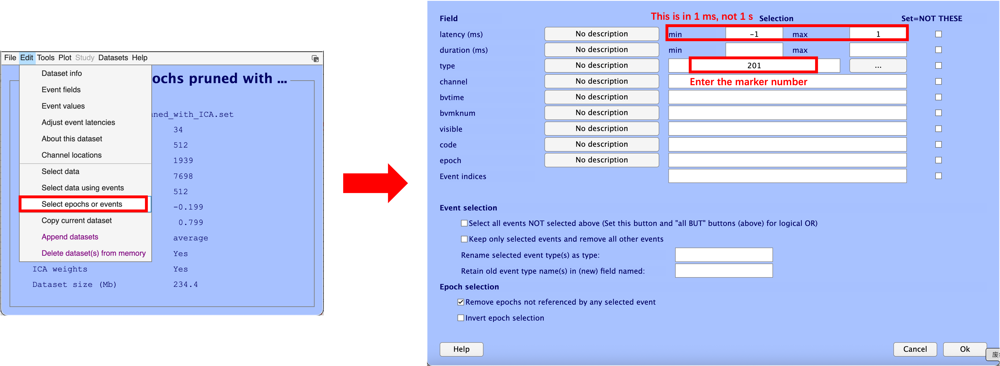

<br>

## Visualizing single-subject data

Although it's widely known that ERP is evoked by certain event, Spapé still suggested us to call ERP with involved modality (such as "visual evoked potential", or "auditory evoked potential" and so on) instead of original external event, when we descirbe it, to show our interest in mental functions rather than external events. When talking about the cause of a potential or how a factor affects it, we can switch to the event-related potential.

### General ERP components

Two methods are used to define “regardless of condition” in VEP:

1. Aggregate epochs from all conditions into one mixed set.
2. Use a minimal control condition as the baseline for all contrasts. (baseline trial)

Strictly speaking, the idea of "silent baseline" may just an illusion, as the brain is always active regardless the stimulus is presented or not. For instance, the resting state research has revealed that some regions are de-activated in the task compared to the non-task condition.

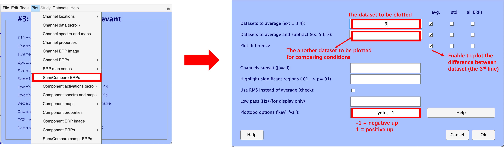

Click `Plot > Sum/Compare ERPs` as figure 9.2 showing. Then a big plot containing all selected chnnels pops out. Clicking any of these sunplots for clearer and large one. Spapé provided some rule of thumb that how to find the similarities and differences between channels by looking at the data plots.

1. A potential is at least **<font color = 'red'>2</font>** times greater than baseline signals.
2. A potential is distributed across multiple electrodes as the scalp diffuses the potential. Adjacent channels share similar pattern.
3. The potential is originated from dipoles inside the head, leading the inverse polarity on the other side.
4. A good measured potential should have a less noisy baseline. If the baseline looks identical to that after the onset of stimulus, something would get wrong.

### Looking at topoplots

Click `Plot > ERP map series > in 2-D` and enter the latency time of interest. The topoplots can show some pattern of potential distribution across the scalp in certain temporal range. The resemblance between two topoplots in different time point indicates that they're actually the same component, while the pattern change suggests component also varies with time.

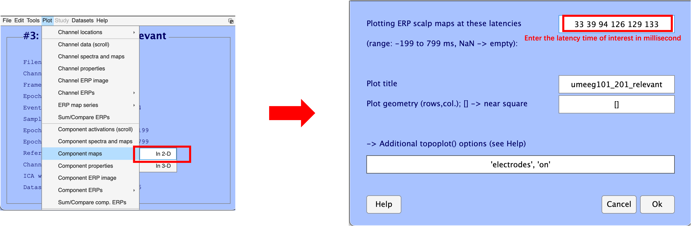

<br>

### Conparing two conditions

Some potentials are observed only by contrast across conditions like P3. So we are going to check the comparison between epochs marked by 203, 202 and 201 (the odds, irrelevant, and relevant).

To conduct this step, just enter the value into the first, second and the third parameters in the dialogue (see figure 9.2).

- `avg.` = plot the average potential when entering multiple datasets.
- `all ERPs` = plot separate potential when entering multiple datasets.

Spapé suggested that don't make the plot too complex. However I have already been overwhelmed by these ERPs plots. Optimistically speaking, the point of this chapter is to know the ERP components from random EEG activities. We will learn how to test the hypothesis about the difference in ERPs between conditions at the group/population level in the next chapter.

## Ch9's exercise: EEG analysis at the individual level

1. Load the pre-processed data and inspect detailed plots for three channels
2. With all conditions mixed, cluster the potentials together into the component by create a table or topoplots
3. Identify components and name them temporarily e.g., N93. Find some literature talking about the components you have
4. Visulize each dataset of participants and try to find similarities and differences.

|channel|time(potential)_1|time(potential)_2|time(potential)_3|...|
|:---:|:---:|:---:|:---:|:---:|
|Cz|<font color = 'red'>34(-0.6)</font>|98(+1.2)|143(-2.2)|...|
|Pz|<font color = 'red'>30(-0.7)</font>|76(+1.2)|170(-2.2)|...|

The steps above just need the visualization skills in this chapter. Note the $\alpha$ wave at **<font color = 'red'>10 Hz</font>** would sometime confuse you when identifying the components. The following steps are about single subject analysis:

1. Prepare the `irrelevant`, `relevant`, and `odd` datasets for one single subject.
2. Compare the `irrelevant` to `relevant` dataset using visualization and record the differences by the table.
3. Go around the dataset of other participants to see if the P3 changes or remains.
4. Do the same operation to the comparison between the `odd` and `irrelevant` conditions. Are there any similarities or differences in the whole time series between pets and irrelevant/relevant faces? Try to attribute the observations.

|channel|diff_1|diff_2|diff_3|...|
|:---:|:---:|:---:|:---:|:---:|
|Cz (condition 1 - condition 2)|<font color = 'red'>34(-0.6)</font>|98(+1.2)|143(-2.2)|...|
|Pz (condition 1 - condition 3)|<font color = 'red'>30(-0.7)</font>|76(+1.2)|170(-2.2)|...|

Wow, totally <font color = 'red'>no statistic calculation</font> at this stage.

## Ch9's exercise: Batch process

This script is just to cluster the epochs by conditions and save the dataset after renaming them. So not too hard to program.

```{MATLAB Ch9_batch, eval = F}
file_list = {
    'umeeg101', '.set';
    'umeeg103', '.set'};
conditions = {
    '201', '202', '203';
    'irrelevant', 'relevant', 'odd'};

% 额外练习1无非也就是嵌套循环，给来自每个被试的数据分epoch以后
% 修改文件头，然后改名存储
for i = 1:size(file_list, 1)

    % 加载文件
    % 但是注意一下，这一步即需要.set也需要.fdt文件
    EEG = pop_loadset('filename', ...
        [file_list{i, 1}, '_10_Pruned_with_ICA', file_list{i, 2}], ...
        'filepath', '.');

    for j = 1:size(conditions, 2)

        % 对每个文件进行condition条件的分类和数据提取
        cEEG = pop_selectevent( EEG, 'latency','-1<=1', ...
            'type', conditions{1, j}, ...
            'deleteevents', 'off', ...
            'deleteepochs', 'on', ...
            'invertepochs', 'off');

        % 提取出来以后修改文件头
        cEEG = pop_editset(cEEG, ...
            'setname', [file_list{i, 1} '_' conditions{1, j}], ...
            'subject', file_list{i, 1}, ...
            'condition', conditions{2, j});

        %保存文件
        pop_saveset(cEEG, [file_list{i, 1} '_' conditions{1, j} file_list{i, 2}]);
    end
end


%%
% 其实还有一个对另一个条件的个体历遍处理
% 就是先选出202 和 201的epochs
% 然后在进一步选择呈现的照片类型
% 然后在分relevant和irrelevant
% 最后editset修改相关信息，比如group参数标注照片类型，再保存数据
% 不过我懒，今天没有动力，效率也不高，直接进入下一章算了
% 唉算了还是搞了把就当练习控制语句了

file_list = {
    'umeeg103', '.set';
    'umeeg101', '.set'};
conditions = {
    '201', '202', '203';
    'irrelevant', 'relevant', 'odd'};
self = {'self', 'other'};

for i = 1:size(file_list, 1)

    % 加载数据
    EEG = pop_loadset('filename', ...
        [file_list{i, 1}, '_10_Pruned_with_ICA', file_list{i, 2}], ...
        'filepath', '.');

    % 先去除无关条件，就是动物的那个203
    EEG = pop_selectevent(EEG, 'latency','-1<=1', ...
        'type', {'201', '202'}, ...
        'deleteevents', 'off', ...
        'deleteepochs', 'on', ...
        'invertepochs', 'off');

    % 然后开始分类我他条件
    for j = 1:length(self)

        % 不同条件那肯定得进行不同的删选
        % 然后自我照片的marker是1
        if j == 1
            cEEG = pop_selectevent(EEG, 'latency','-200<=0', ...
                'type', {'1'}, ...
                'deleteevents', 'off', ...
                'deleteepochs', 'on', ...
                'invertepochs', 'off');
        else
            cEEG = pop_selectevent(EEG, 'latency','-200<=0', ...
                'type', {'1'}, ...
                'deleteevents', 'off', ...
                'deleteepochs', 'on', ...
                'invertepochs', 'on');
        end

        % 然后改一下文件头
        cEEG = pop_editset(cEEG, ...
            'group', self{j});

        % 然后进一步把相关不相关的条件给选出来
        % 然后这一步有个try catch语句可以留意一下
        % 这个语句就是加入报错就执行备用方案
        % 因为自我*相关的各个条件的trial不一定够，
        % 这一步分epoch可能就中间不知道哪里报错
        % 然后用try catch语句执行，报错返回一个信息然后执行下一个文件

        for k = 1:2
            % 因为只要分类201 202，所以这里就1:2


            try
                cEEG = pop_selectevent(cEEG, 'latency','-1<=1', ...
                    'type', conditions{1, k}, ...
                    'deleteevents', 'off', ...
                    'deleteepochs', 'on', ...
                    'invertepochs', 'off');

                % 修改文件头和保存文件
                ccEEG = pop_editset(cEEG, ...
                    'setname', [file_list{i, 1} '_' self{j} '_' conditions{1, k}], ...
                    'group', self{j}, ...
                    'condition', conditions{2, k});

                pop_saveset(ccEEG, ...
                    [file_list{i, 1} '_' self{j} '_' conditions{1, k} file_list{i, 2}]);

            catch ME
                % 然后是如果报错怎么办
                % 不耽误它跳过然后执行下一个loop
                disp (ME.message)
                disp ('Probably not enough rel_self epochs!');
                fprintf('Error processing file: %s, condition: %s\n', file_list{i, 1}, conditions{1, k});
                
            end
        end
    end
end
```

# Ch10 Average analysis

## Visualizing multi-subject data

Because there is a individual difference in event-related potential for the same task, we need to do a **<font color = 'red'>grand average</font>**, namely average across subjects, to make a scientific conclusion. Since we have averaged the potential across epochs, the current operation is called "grand average", meaning we are averaging the averaged individual ERP.

To do so, we rely on the `STUDY` structure of eeglab, which helps not only ERPs, but also time/frequency analysis. Besides, it provides way to conduct basic statistical analysis for one-way or two-way design.

### Create the study design in eeglab

In the last chapter we aggregated all conditions into one mixed dataset to create a controlled condition (regardless the conditions). For this chapter, we will use the **<font color = 'red'>minimal control condition</font>**, namely use a condition with minimal manipulation as a baseline. Specifically, it's loading all `*_irr.set` (but it's pity that I can't use the format of "*_irr.set" to search the file in Finder) first into the eeglab.

Then click `File > Create Study > Using all loaded dataset`. Then we can name the new study and check the condition & group label. Press "OK" if everything is done. The principle is make sure the name of condition and group is **consistent**, otherwise the eeglab would mistakenly recognize your experimental design. If we have written the information correctly by `pop_editset()` at the previous steps, all these will be filled automatically in current the dialogue.

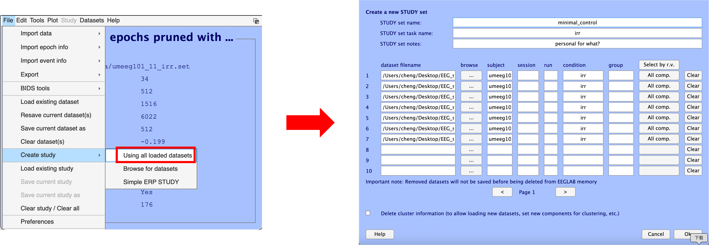

<br>

One thing special then is that Spapé used a group of samples with different number of channels. Therefore we need to fix it up, interpolating the values of missing channels (e.g., there are 34 channels for `umeeg101` whereas 64 channels for `umeeg102`). Click `Study > Precompute channel measures`. In the pop-out dialogue, according to Spapé, leave the ICA-related item unchecked, and no necessity to specify the parameters here. Although **the function of precomputation is to calculate the values required by latter visualization, <font color = 'red'>in advance</font>**.

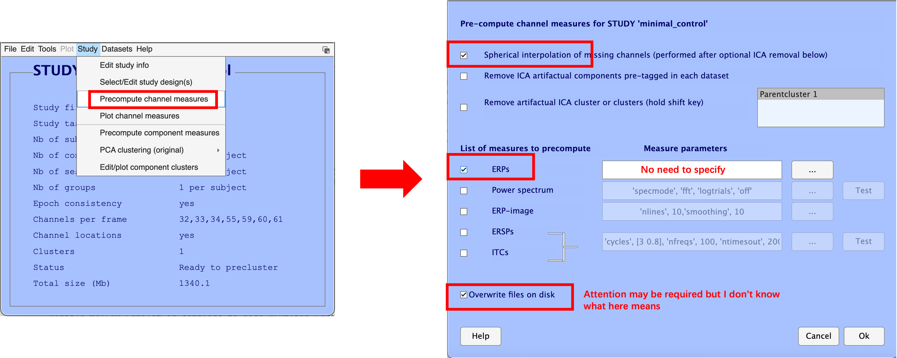

<br>

### Looking at grand average ERPs

Click `Study > Plot channel measures` and choose the command on the left or the right panel (see figure 10.2.). However the outliers has a worse effect on the average potential as it's a series of average point that is correlated in time and space.

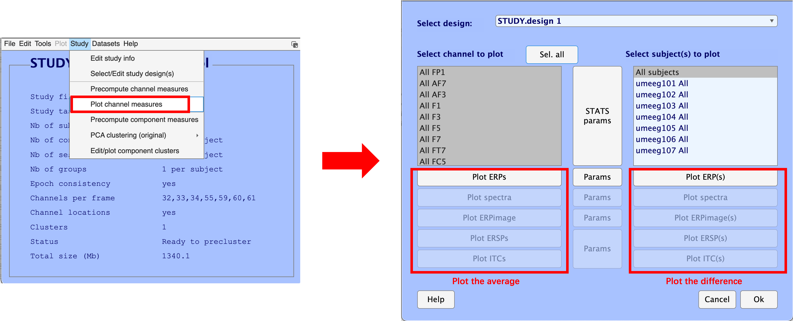

<br>

The correlation between channels interferes the independent assumption of statistics and amplifies the effect of outlier on the analysis (one channel contaminates the rest part of data from other electrodes). Moerover, bad data also pollutes the later timepoints, especially the low-pass filter of 80 Hz has been applied. 即离群值在时间和空间上的污染.

> Generally, EEG has greater power in lower (such as 2 - 10 Hz) frequency than higher frequency, so the its activities are quite similar within earlier period like 50 ms (1000 ms / 20 Hz).

The outlier is one with potential beyond more than $\pm$ 2 standard deviation from the average level. Once a true outlier is detected, we should go back to the previous steps to see if any problem could have been solved such as reject more artifacts.

Then use the skills from chapter 9 to identify the components by plot at the group level. For example, recognize the basic components like P1, N1, P2 and N2; and the components different between conditions. <font color = 'red'>But how to create topoplot matrix instead of a single plot at population level???</font>

## Time/frequency analysis

EEG is a sum (synchronization and de-synchronization) of oscillation at frequency bands. A new one synchronization or the stopping of the old synchronization (de-synchronization)? For instance, the event-related de-synchronization of $\alpha$ rhythm is a signal of being active.

```{MATLAB Ch10_EEG_music, eval = F}
% first load a epoched dataset
% I used umeeg101 for this
EEG = pop_loadset( ...
    'filename', 'umeeg101_10_Pruned_with_ICA.set', ...
    'filepath', '.');


% this command will play the sound composed by the channel 5 and 8, all
% timepoints of the first epoch
sound(EEG.data([5 18], :, 1));


% if we have loaded a study set, we can use the command below
sound(ALLEEG(1).data([5 18],:,1))
```

The idea is that, to find out the link between mind and brain, we can use the **<font color = 'red'>Fourier transformation</font>** onto the EEG data, so that decomposing the time series into a frequency spectrum, allowing us to see the contribution of each frequency band to the power. Pure Fourier transformation loses time information so it tells a little about event-related thing. However, by applying **<font color = 'red'>time/frequency analysis</font>**, we still keep the temporal precision when decomposing the EEG signal into spectral properties.

time field -> frequency field

**<font color = 'red'>Wavelet analysis (小波浪分析?)</font>** is a common way to achieve time/frequency analysis. This technique roughly uses a template/model of a wave, whose frequency is defined by its shape changing, to compare or match the potential wave of actual signal. The more it mated, the greater power is at a certain frequency. 这个玩意就是用一个波形模版，这个模板可以通过拉伸改变频率，去跟你原始信号进行比对。然后实际信号和不同频率的模板比对得越匹配，说明这个频率的功率越高。然后功率高低用颜色表示，纵轴表示频率，时间横轴得以被保留。

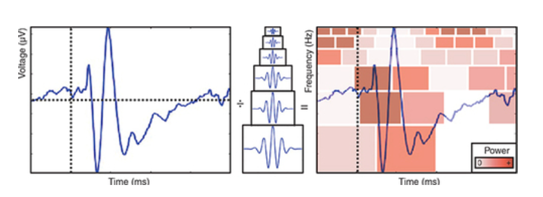

<br>

### Spetrum analysis

Click `Study > Precompute channel measures` and enable the option of `Power spectrum` in the pop-out dialogue. Press `Test` to see a pilot spectum plot for the first 20 trials of the first participant.

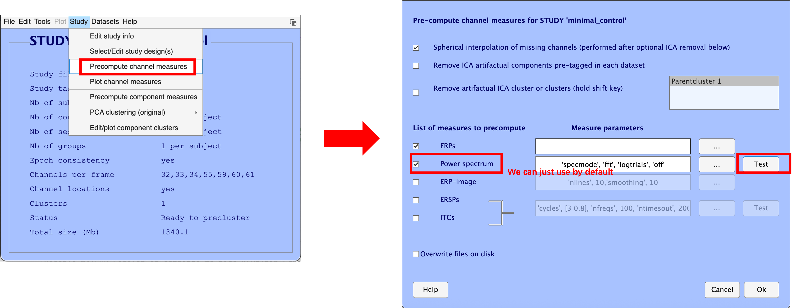

<br>

The point of pilot plot is to see whether the resolution of the picture fits the research question. Specifically, if we are interested in the neural activities around 6.5 to 7 Hz, data should be found within this frequency bands. And

- The lower limit of frequency = $\frac{1}{\text{time window of analysis (s)}}$
- The upper limit of frequency = $\frac{\text{sample rate}}{2}$

Then we want to see the spectrum plot for the whole study set. Click `Study > Plot channel measures`. We can set the certain range of frequency (e.g., 0 - 80 Hz) to plot by click the `Params` near `Plot spectra`. 

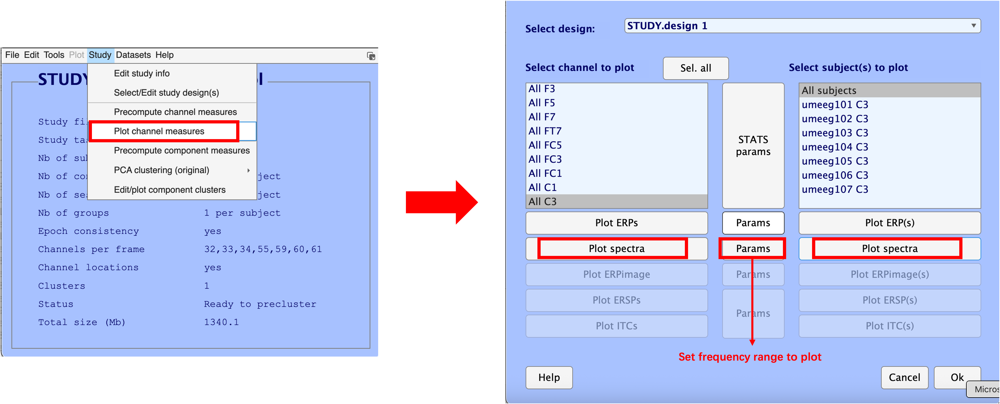

<br>

The $\alpha$ rhythm is easy to see on the spectrum plot. Apart from that, the $\alpha$ can also be seen on the topoplot by clicking `Params` near the `Plot spectra`, set `Frequency` within 7 - 12 Hz, and select `Plot averaged topography over frequency range` (multiple channels need to be selected). We can see the increasing $\alpha$ power around parieto-occipital region, consistent with classical theory of $\alpha$ wave. The point is, it's always better to compare topoplot for **<font color = 'red'>multiple frequency under different conditions</font>** rather than simply "where is it". 频谱图最有意义的是条件差异 (**<font color = 'red'>condition contrast</font>**).

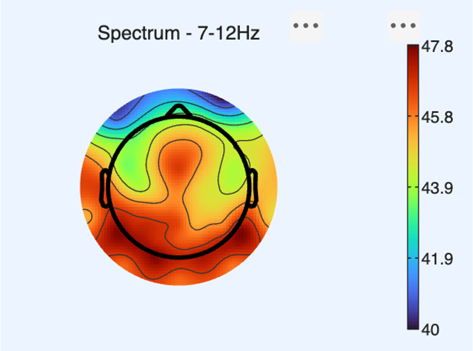

<br>

### Time/frequency analysis

To conduct this analysis. Same as before, `Precompute` -> `Plot`. But we need to adjust parameters of `ERSPs` or `ITCs` for time/frequency analysis.

|indicator|what is reflected|meaning|symbol in the plot|
|---|---|---|---|
|`ERSPs`|power 功率|参与该频段的神经元数量是否增加|红=ERS，蓝=ERD|
|`ITCs`|phase-locking 相位同步|神经元是否在同一时间点对齐相位|黄/红=高同步|

- ERS = Event‑Related Synchronization
- ERD = Event‑Related Desynchronization

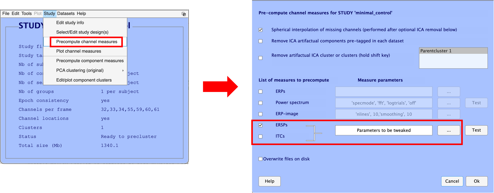

<br>

Given the core of wavelet analysis is actually match waveform with some kinds of template, one issue is that the lower frequency may has lower temporal resolution because the slow wavelet's long cycle exceeds the time window of analysis. One illustration is, if we employ a wavelet with 1 Hz (has its cycle of 333 ms) onto a epoch in which the stimulus onset is at 200 ms, the first wavelet is from -200 to 133 ms, across the onset time. This may be confusing for us to figure out whether that wavelet is resulted from the stimulus. However, too fast wavelet also gives arise of other issue: it may capture many random spike instead of interested oscillation.

So, how to choose a good enough wavelet to conduct our analysis? "It depends"... Spapé gave some principles: **pursue the optimal temporal resolution by testing out different number of cycles**. For example, use 1 cycle for lower frequency and increase the cycle for higher frequency. To do so, time to change the parameters into:

```{MATLAB Ch10_wavelet_precom, eval = F}
'cycles', [1 0.5], 'nfreqs', 50, 'maxfreq', 80, 'ntimesout', 50

% 'cycles', [1 0.5] 改变周期数，这里是个数组，低频周期从1开始，高频周期0.5结束
% 'nfreqs', 50 设定总共跑几个wavelets
% 'maxfreq', 80 设定wavelet的频率上限，这里80，和我们的感兴趣频段与低通滤波一致
% 'minfreq' 虽然这段代码没有，不过值得一说，eeglab默认最低频率是3 Hz
% 'ntimesout', 50 保留时间点的数量，原本不是1秒512个时间点吗，Spapé为了节省算力
```

## Contrasting conditions

### Comparing conditions in a one-way design

Now we need to create a study set containing both of `irr` and `rel` conditions. `Study > Plot channel measures` after pre-computation. Some parameters need to be set for making it easier to make comparison between plots under two conditions (see the figure 10.6).

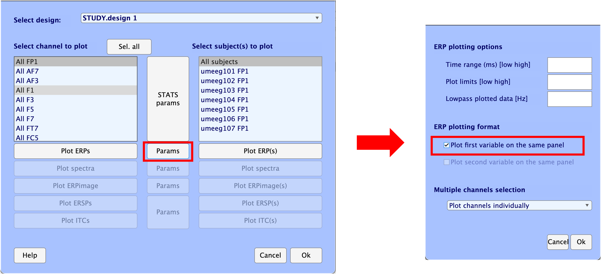

<br>

So far we have inspect the data always by visualization and naked eyes, but too much randomness in such analysis that is non-replicable. So we need to carry out the statistical things with carefulness in the next chapter. Spapé introduced some **<font color = 'red'>problematic statistics</font>** here. I think this "bad" stat may be a way to explore the data and hypothesis in the real-life practice, as He Zhenhong did so.

> "a solid effect in the main contrast doesn’t generally disappear – the way that vague, non-replicable effects do sometimes appear by applying questionable statistics"

Click `Study > Plot channel measures > STAT params`, and use `parametric statistics` with the threshold of `0.001`. Don't forget enable "plot first variable on the same panel". Then press the `Plot` button will return you the results.

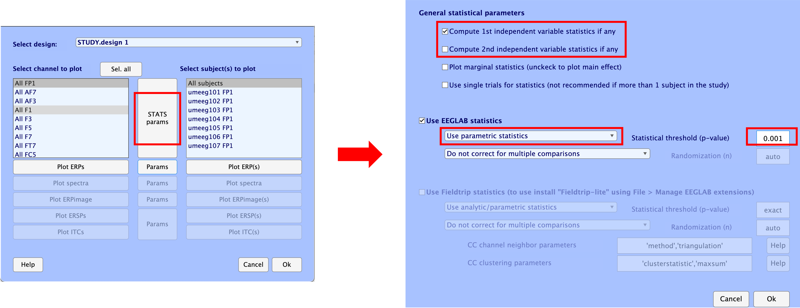

<br>

### Comparing conditions in a multifactorial design

This section is about conduct 2 $\times$ 2 design analysis. Remember in the end of the last chapter, we used batch script to separate epochs into 4 categories? That is. It's pity that eeglab isn't component to create a good plot for such design, Spapé thereby suggested use other software and would talk about it in the chapter 11.

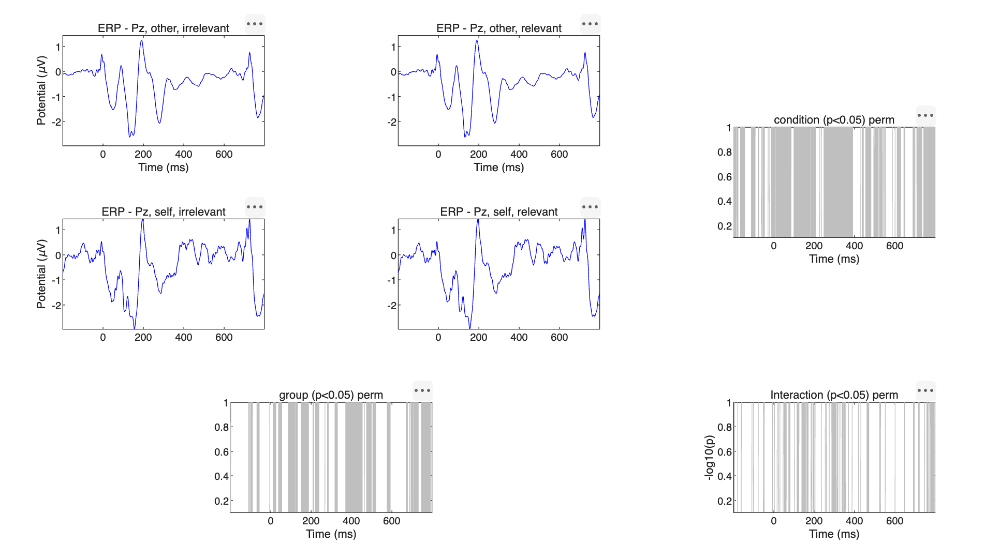

<br>

### Interpreting differences in the ERP

**<font color = 'red'>Region of interest (ROI)</font>**? Clusters? Going through the plot channel measures? Couldn't Spapé do this part step by step? Can't understand the aim and meaning of this part and what are the output used for? Of course I know is to test the hypothesis.

In this section, just for tutorial, Spapé went through a plenty of contrast plot and note the significant time range down, then summarize the clusters from electrodes of interest (ROI). It's similar with the skill to define the component in chapter 9. Once a cluster which is spatial and temporally continuous is defined, we can just pick up the most representative channel to analyze.

Spapé then introduce some mistakes in attributing the cause of difference.

#### Different baseline or ERPs

- 如果你在 ERP 的非常早期看到条件差异，那通常是 baseline 出问题

- 如果在 ERP 的非常晚期看到奇怪的bump，那通常是因为下一张刺激或黑屏本身引发了新的视觉 ERP

- 而在选择反应任务中，反应时差异会进一步污染 ERP。

- 最终结论：ERP 必须结合“物理上下文”（刺激序列、黑屏、反应时、任务结构）来解释，而不能只盯着成分本身。

This length of baseline affects the rest part of EEG signals, so the longer one has more reliability to some extent. However, the baseline itself is influenced by more factors than mere its length. For example, in current experiment of tutorial, a relevant stimulus can only following irrelevant stimulus; whereas an irrelevant stimulus following either relevant or irrelevant images. Give our epoch is from -200 to 800 ms, while the stimulus of next trial emerges at 700 ms, so such experimental design causes distortion of early potential for irrelevant that occurs after relevant. Another issue also stem from the overlapping epochs. The late period potential is affected by the following stimulus.

Moreover, response-evoked potential also shows issue especially when the stimulus is **<font color = 'red'>terminated</font>** by that response (in that experiment design, you may present the stimulus while asking subject do something. e.g., "press space when you see the odd ball"). In this case, a visual change such as a blank screen inevitable affects the signal. However, even if we don't allow the response to terminate the stimulus, the signal is still contaminated by motor preparation and execution, making it hard for us to distinguish whether the difference is due to the stimulus or response.

In a word, we need to be careful with **<font color = 'red'>illsory difference</font>** and to put the ERPs into their physical context.

#### Which ERP component is affected

ERP 成分是「潜成分」(latent components)，不是你看到的波形本身

你看到的波形形状 $\neq$ 成分本身的真实形状

潜在成分会重叠，建议用奥卡姆剃刀

The observed potential is shaped by how we define a ROI. We may operationalize P2 is a potential from 230 - 270 ms. But attention, this time window is decided by youself, thereby you should know to what extent this window also contains other signal/components (e.g., P3 maybe in range of 250 - 330 ms). Therefore, this is about a problem that, **<font color = 'red'>EEG is a sum of massive neural activities, and the collected data is the sum of multiple latent components</font>**. As the figure 10.8 demonstrated, such sum feature genuinely changes what we can see about N2. The true temporal ROI should be slightly later than we observed.

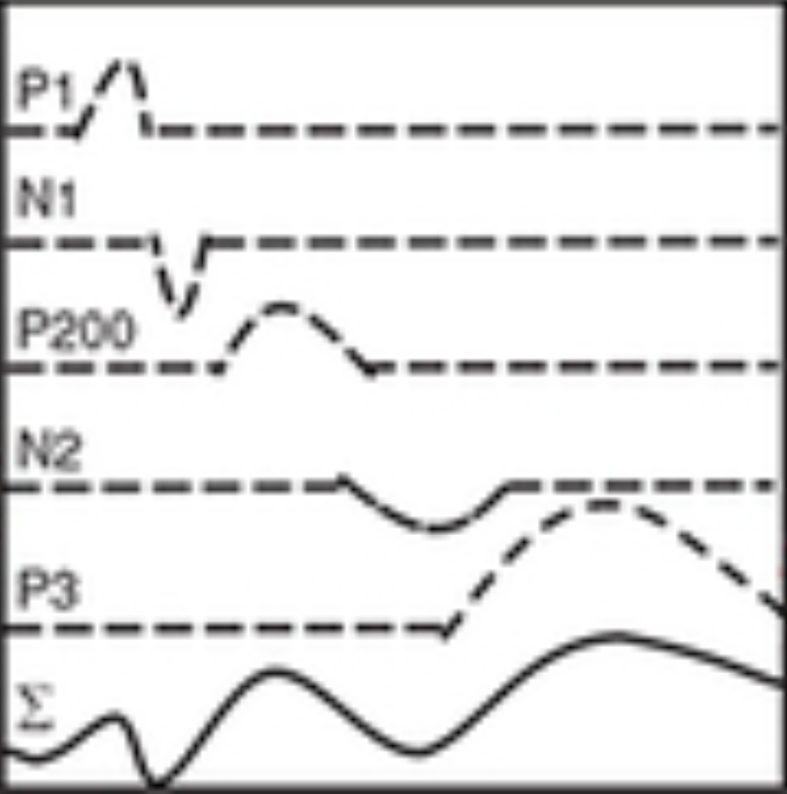

<br>

#### Comparing ERPs with different number of epochs

在比较 ERP 波形形状或峰值大小时，潜伏期（latency）差异会造成严重问题。

当你把很多试次平均成 ERP 时，如果这些试次的成分出现时间不一致（latency variability），平均后的波形就会：峰值变矮（peak magnitude ↓）、波形变宽（fatter）、整体变平（flatter）。

当你比较 ERP 波形或峰值时，潜伏期差异会让你看到误导性的视觉差异（flattening、smearing），所以必须用更稳健的指标或方法来处理。

latent EEG = neural/psychological cause + physical/artifacial cause. This brings a situation that a peak may occur at $x$ ms for current trial, and occurs at $y$ ms in another epoch/trial. So averaging these epoch together inevitably distorts/flattens the signal as the latency varies for some reasons. Try to make the number of epoch equivalent between conditions when doing the comparison.

> "Or to put it as an easy-to-remember rule: the more epochs within an ERP, the fatter and flatter it will be".

Back to current experiment, the number of epochs follows: `irr` > `rel` > `odd`. SO, be careful.

- delete the `irr` trial until it's equalized
- single trial measures
- analyze the average potential instead of peak value

## Ch10's exercise

1. 首先不做对比看有何成分

2. 然后看对比和假设？

3. 解释差异：基线、成分叠加、试次差别

此处我只留了额外练习2的练习笔记，因为其他练习像是看片子一样，我自己心里也没有个准头，还得花大量时间。

```{MATLAB Ch10 plot, eval = F}
% 加载数据先

participant = {'101', '102', '103', '104', '105', '106', '107'};
condition = {'irr', 'rel'};
path = '/Users/cheng/Desktop/EEG_study/data_for_study/Chapter 10/data';

EEG = pop_loadset( ...
    'filename', ...
    ['umeeg', participant{1}, '_11_', condition{1}, '.set'], ...
    'filepath', ...
    path);


%%
% 然后它后面初期的内容有点像我那个matlab的练习
% 去结构体查channel location然后
% 按照维度平均以后plot

figure;
plot(EEG.times, mean(EEG.data(25, :, :), 3), ...
    'b', 'linewidth', 4);


%%

participant = {'101', '102', '103', '104', '105', '106', '107'};
condition = {'irr', 'rel'};
path = '/Users/cheng/Desktop/EEG_study/data_for_study/Chapter 10/data';

% 问题是我是想知道Study的图咋画
% 首先需要创建空列表，结构和EEG差不多，但是多一个维度是被试号
% 然后假如我们就画俩通道的信息, 第三个维度2
% 还有就是我们要叠加平均，所以最后那个512就是这样来的
% 最后我们有俩conditions，第二个维度那个2就是这样来的
ERP = zeros(7, 2, 2, 512);


% 下面我们才可以开始准备画图用的数据

for cpeople = 1:size(ERP, 1)
    for ccondition = 1:size(ERP, 2)

        % 然后先加载数据，每个人每个条件的数据
        EEG = pop_loadset( ...
        'filename', ...
        ['umeeg', participant{cpeople}, '_11_', condition{ccondition}, '.set'], ...
        'filepath', ...
        path);


        % 但是有个问题就是我们的感兴趣channel是Pz和Cz
        % 然而这七个被试用的设备不一样，然后他们对应这俩通道的编号也不一样
        % cell array 不能用 == 来比较
        % strcmp({}, '')就是看两者是否相等，就是字符细胞的find()
        % 所以得先提前查出来通道编号并使用另一个list记录
        chan(1) = find(strcmp({EEG.chanlocs.labels}, 'Cz'));
        chan(2) = find(strcmp({EEG.chanlocs.labels}, 'Pz'));

        % 然后是选择通道，把叠加平均的数据记录到list的对应位置
        for cchan = 1:size(ERP, 3)

            ERP(cpeople, ccondition, cchan, :) = mean(EEG.data(chan(cchan), :, :), 3);

        end
    end
end


%%
% 以上是统计特定通道特定条件的叠加平均，然后把所有被试都纳入记录
% 下面就该是利用我们准备好的数据进行画图了
% 现在是ERP是每个被试不同通道和条件下已经按照epoch平均了的数据
% 再可视化就是进一步按照被试维度进一步平均

% 这样它能自动在同一图中比较俩条件
Cz_mean = squeeze(mean(ERP(:, :, 1, :), 1));

plot(EEG.times, Cz_mean)

%或者这样一样的效果
Cz_irr_mean = squeeze(mean(ERP(:, 1, 1, :), 1));
Cz_rel_mean = squeeze(mean(ERP(:, 2, 1, :), 1));

figure;
plot(EEG.times, Cz_irr_mean);
hold on
plot(EEG.times, Cz_rel_mean);
hold off


%%
% subplot就更不用说了，这次加入俩通道
Cz_mean = squeeze(mean(ERP(:, :, 1, :), 1));
Pz_mean = squeeze(mean(ERP(:, :, 2, :), 1));


subplot(2, 1, 1);
plot(EEG.times, Cz_mean);
title('Cz mean potential');
xline(0, '--k', 'LineWidth', 1.5);  % 那条虚线
% plot([0 0], ylim, '--k', 'LineWidth', 1.5) 旧版这样画虚线，别忘了hold on
legend({'irrelevant', 'relevant'});  % 图例最后画
subplot(2, 1, 2);
plot(EEG.times, Pz_mean);
title('Pz mean potential');
xline(0, '--k', 'LineWidth', 1.5);
```

# Ch11 Inferential statistics and reporting results

This chapter is about doing inference a general rule for a population given data from a experiment sample, using statistical (quantitative) method.

## Exporting data

What we did in the chapter 9 and chapter 10 is preparation to find/define a ROI with particular latency and spatial distribution, allowing us to calculate the final measurement.

ROI helps to operationalize abstract P3 component into a metric. Two ways to select a ROI:

- literature-based
- data-driven

However, the previous practice requires caution: we can't see the plot in Ch10 and define P3 is average potential from 300 - 350 ms over `Pz` (this is a ROI), then calculate p value between that time window at the group level. Such is a questionable research practice as we **<font color = 'red'>double-dipped</font>** our data: <u>doing hypothesis-exploration and hypothesis-testing using ***the same data set***</u>. So how to choose a ROI correctly?

In the chapter 10, Spapé chose two ROIs involving frontal (from 270 - 350 ms) and centro-parietal (from 370 - 800 ms) regions, although the specific channels will be redefined as some participant didn't have some electrodes. These two ROIs answered the first two questions below, while remaining the last one:

- [x] `When`: The selected electrodes

- [x] `Where`: The selected time window/latency

- [ ] `What`: What metric to be used 

  - Global peak, not so good
  - Local peak, sensitive to high frequency noisy, low-pass filter helps with cost
  - Averaged amplitude, robust
  - Area under curve (AUC), robust
  
\begin{align}
\text{Mean amplitude} &= \frac{1}{N} \sum \limits_{1}^{N} V_i \\
\text{Area under curve} &= \int_{t_1}^{t_2} V(t) dt
\end{align}

Although it's widely known that $\int$ seems more precise than $\sum$, it would have such great difference between these two at the resample rate of 512 Hz.

### Conforming datasets


<br>

Before analysis we may need to interpolate the missed channels to make data from participants consistent with each other and comparable. For current data, obviously participants have different number channels. Spapé did this in this chapter but I saw many researchers would interpolate during their pre-processing.

Click `Tools > Interpolate electrodes` as figure 11.2 shown. Spapé suggested to conduct the last option onto all datasets, using a **<font color = 'red'>raw data</font>** with all electrodes. Emmmmm. Additionally, Spapé said in the additional exercise we can learn script-based method to do the interpolation whereas Hongcheng research group required do this manually.

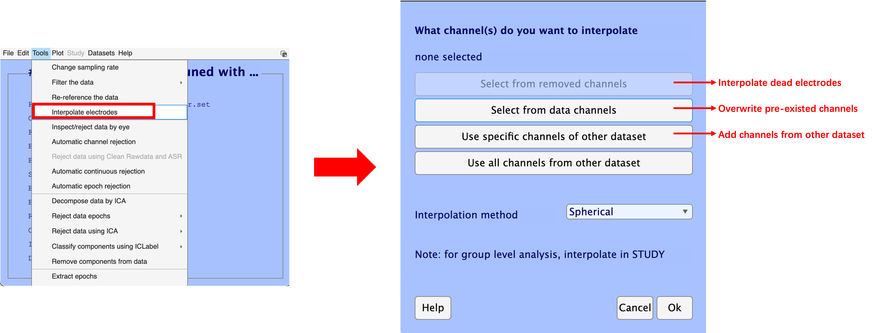

<br>

Spapé also mentioned that, although eeglab provides way to do interpolation in the study design, it make export harder to do. So interpolate single-by-single is recommended. Moreover, ROI cues are also provided:

- Essential track: 

  1. ROI 1: Cz (270 - 350 ms)
  2. ROI 2: Pz (370 - 600 ms)
  
- Additional track:

  1. ROI 1: FC1, Cz, and FC2 (270 - 350 ms)
  2. ROI 2: CP1, Pz, and CP2 (370 - 600 ms)

Then, summarize the ROIs information by table like below (I just made up the specific number, ignore them please):

|Subjects|ROI 1 (FC1, Cz, FC2) channel number|ROI 2 (CP1, Pz, C2) channel number|
|---|---|---|
|1|2 3 14|12 23 22|
|2|...|...|
|3|...|...|
|4|...|...|
|...|...|...|

I think `find(strcmp({EEG.chanlocs.labels}, 'Cz'))` may help for this step.

### Using MATLAB to export data

What a shame, visualization by excell (2333:

> "Furthermore, any EEG/ERP paper worth its salt will present an ERP figure, and these are a lot easier to produce in spreadsheets software such as Excel than in MATLAB."

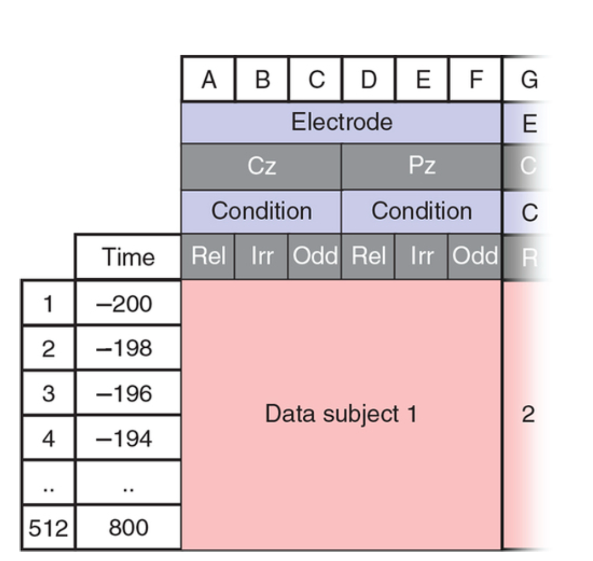

<br>

I just directly use the "harder" method in Spapé's book.

```{MATLAB Ch11_exporting, eval = F}
% 为了能够进行下去教程，不得不将11章的数据全部覆盖
% 但是我不确定我那个插值是否有问题，最后全tm70个通道了
% 不过实际实验谁tm会用那么极端的情况啊，被试通道数都tm不一样


%%
% 用于循环的准备好变量列表
participant = {
    'umeeg101', 'umeeg102', 'umeeg103', 'umeeg104', ...
    'umeeg105', 'umeeg106', 'umeeg107'
    };

conditions = {
    'rel', 'irr', 'odd'; 
    '201', '202', '203'};

channels = {
    'FC1', 'Cz', 'FC2';  % ROI 1
    'CP1', 'Pz', 'CP2'   % ROI 2
    };

path = '/Users/cheng/Desktop/EEG_study/data_for_study/Chapter 11/data';


%%

% 先给这个循环加个计数功能
count = 0; %用来显示当前所在循环数
total = size(participant, 2) * size(conditions, 2) * size(channels, 1) * size(channels, 2);

% 然后这个空列表用来放置数据
% 因为这个表格我们同时有存字符和数值，所以用cell
% 必须初始化cell的尺寸
% 只是 out_data = {}就是一个1*1的空cell，它不会自动拓展
out_data = cell(512 + 1, total);

for cperson = 1:size(participant, 2)
    for ccond = 1:size(conditions, 2)

        % 数据应该从这里加载
        cEEG = pop_loadset( ...
            'filename', ...
            [participant{cperson} '_11_' conditions{1, ccond} '.set'], ...
            'filepath', path);

        for cROI = 1:size(channels, 1)
            for cchan = 1:size(channels, 2)

                % 数据应该在这里提取然后录入list
                % 首先确定当前通道的号码
                chan_num = find(strcmp({cEEG.chanlocs.labels}, ...
                    channels(cROI, cchan)));
                % 然后把该被试这个通道此条件下的电位平均以后提取出来
                temp_data = mean(cEEG.data(chan_num, :, :), 3);


                % 写入单个cell单元格的时候用{}
                out_data{1, count + 2} = [participant{cperson} '_' conditions{1, ccond} '_ROI' num2str(cROI) '_' channels{cROI, cchan}];
                
                % 写入多个单元格的时候（不是512个数值吗）用()
                out_data(2:end, count + 2) = num2cell(temp_data);
                
                % 写个进度条显示
                count = count + 1;
                fprintf('current pregress: %.2f %% \n', 100 * count/total)
            end
        end
    end
end


% 最后加上时间数据
out_data{1, 1} = 'time';
out_data(2:end, 1) = num2cell(cEEG.times);


%%
% 最后导出数据

% 这是导出为txt
writecell(out_data, './erp_data.txt', 'Delimiter', '\t'); % \t是txt制表符

% 这是导出为csv
writecell(out_data, './erp_data.csv', 'Delimiter', ',');
```

## Spreadsheet

My script is different from that used by Spapé: it allows to add the header automatically. Once being opened in Excell, we can see it isn't a "pure" number table. Based on that and the logic inside the code, I think this script is somehow more "superior" than tutorial code. At least Spapé created new time variable/column in the excell instead of using the original `EEG.times`. And his method required more PC memory.

### Computing area averages

Why not do this step by `R`? Being more reproductivity.

```{r Ch11_cal_averages}
# 进入R的舒适区了md
# library(tidyverse)

# 导入数据
# 这是ROI_1的，不区分条件
read_delim(
  file = './data_for_study/self_study/export_data/erp_data.csv', 
  delim = ',', 
  show_col_types = F  #此参数用于屏蔽多余信息
  ) %>% 
    filter(time > 270 & time < 350) %>% 
      select(contains('ROI1')) %>% 
        pivot_longer(cols = everything(), 
                     names_to = c('subject', 'cond', 'ROI', 'chan'), 
                     names_sep = '_', 
                     values_to = 'potential') %>% 
          group_by(subject, chan) %>% 
            summarize(mean_potential = mean(potential), 
                      .groups = "drop_last" 
                      )

# 这是ROI_2的，不区分条件
read_delim(
  file = './data_for_study/self_study/export_data/erp_data.csv', 
  delim = ',', 
  show_col_types = F) %>% 
    filter(time > 370 & time < 600) %>% 
      select(contains('ROI2')) %>% 
        pivot_longer(cols = everything(), 
                     names_to = c('subject', 'cond', 'ROI', 'chan'), 
                     names_sep = '_', 
                     values_to = 'potential') %>% 
          group_by(subject, chan) %>% 
            summarize(mean_potential = mean(potential), 
                      .groups = "drop_last")
```

### Peak magnitudes and latency

I still use `R`.

```{r Ch11_magnitude_max}
read_delim(
  file = './data_for_study/self_study/export_data/erp_data.csv', 
  delim = ',', 
  show_col_types = F
) %>% 
  filter(time > 270 & time < 600) %>% 
  select(
    contains('umeeg101') & contains('Cz'), 
    time
    ) %>% 
  pivot_longer(cols = -time, 
               values_to = 'potential', 
               names_to = 'cond') %>% 
  group_by(cond) %>% 
  slice_max(potential, n = 1)
```

However, this method often fails as it can just detect the global maximum within a certain time range (always falls into the **border** of time range), while the local maximum needs more advanced method such as `pracma::peak()`. Otherwise, visually inspect the plot of each column and change the time range to be processed by `slice_max()`.

the output of `pracma::peak()` is a matrix with the structure:

|peak value|peak index|start index|end index|
|---|---|---|---|
|-0.532623100|18|1|39|
|...|...|...|...|

```{r Ch11_local_max}
# 加载包
library(pracma)

# 首先创建所需的数据框，似乎还是需要长格式的
df <- read_delim(
  file = './data_for_study/self_study/export_data/erp_data.csv', 
  delim = ',', 
  show_col_types = F
) %>% 
  filter(time > 270 & time < 600) %>% 
  select(
    contains('umeeg101') & contains('Cz'), 
    time
    ) %>% 
  pivot_longer(cols = -time, 
               values_to = 'potential', 
               names_to = 'cond')


# 为了示范，我们先使用一个被试的Cz通道irr条件的电位
df <- df %>% 
  filter(cond == 'umeeg101_irr_ROI1_Cz')

# 然后这里是findpeaks的基本用法
# 输出的矩阵
pracma::findpeaks(
  df$potential,  #作用列
  minpeakheight = mean(df$potential) + sd(df$potential),  #一个峰最小要达到多大
  minpeakdistance = 20,  #峰之间至少要间隔多少个采样点。
  npeaks = 1  #返回几个峰
  )

# 然后EEG不是还有负峰吗，所以对应解决方法就是，取负数找
pracma::findpeaks(- df$potential)
```

So how to automatically find the peak of each conditions and of each channel? I tried to combine `pracma::findpeaks` with `summarize`.

```{r Ch11_local_peak}
# 同样的先准备好长数据
# 假设我们只搞ROI1的数据
df <- read_delim(
  file = './data_for_study/self_study/export_data/erp_data.csv', 
  delim = ',', 
  show_col_types = F
) %>% 
  filter(time > 270 & time < 350) %>% 
  select(
    contains('ROI1'), 
    time
    ) %>% 
  pivot_longer(cols = -time, 
               values_to = 'potential', 
               names_to = c('subject', 'cond', 'ROI', 'chan'), 
               names_sep = '_') %>% 
  select(-ROI)


# 然后数据应该得分一下组
# 负峰的就先略
df %>% 
  group_by(chan, cond) %>% 
  summarize(
    pos_peak = {
      p <- pracma::findpeaks(potential, 
                             minpeakheight = mean(potential) + sd(potential), 
                             minpeakdistance = 20, 
                             npeak = 1)
      
      if (is.null(p)) NA else p[1,1]
    }, 
    pos_latency = {
      p <- pracma::findpeaks(potential, 
                             minpeakheight = mean(potential) + sd(potential), 
                             minpeakdistance = 20, 
                             npeak = 1)
      
      if (is.null(p)) NA else time[p[1,2]]
    }, 
    .groups = "drop_last"
  )
```

### Crafting ERP figures

Ha! data visualization with `R`!

```{r Ch11_ERP_plot}
# 假如我们只可视化Cz通道ROI1的数据
df <- read_delim(
  file = './data_for_study/self_study/export_data/erp_data.csv', 
  delim = ',', 
  show_col_types = F
) %>% 
  pivot_longer(cols = -time, 
               values_to = 'potential', 
               names_to = c('subject', 'cond', 'ROI', 'chan'), 
               names_sep = '_') %>% 
  filter(chan == 'Cz')
  

# 然后我们似乎需要把被试信息给平均掉
# 之后我们就可以画图了
df %>% 
  group_by(chan, cond, time) %>% 
  summarize(grand_erp = mean(potential), 
            .groups = 'drop_last') %>% 
  ggplot() + 
    geom_line(aes(x = time, y = grand_erp, color = cond)) + 
    geom_vline(xintercept = 0, linetype = 'dashed') + 
    geom_hline(yintercept = 0) + 
    labs(title = 'Grand ERP for Cz potential', 
         x = 'Time',  
         y = expression('Voltage at Cz (' *mu* 'V)')) +
    theme_classic() + 
    theme(plot.title = element_text(hjust = 0.5)) + 
    scale_color_discrete(
      name = 'Conditions', 
      labels = c('irr' = 'Irrelevant', 
                 'rel' = 'Relevant', 
                 'odd' = 'Odd ball'), 
      breaks = c('irr', 'rel', 'odd')
    )
```

**<font color = 'red'>Any accidental difference in waveform compared to that in the tutorial is due to the fucking interpolation for our data with extreme situation that participants have varying channel number!</font>**

Although creating a plot is not quite hard, there are some tips on **<font color = 'red'>graph design</font>** advised by Spapé.

1. A plot should be about <u>8.5 cm</u> and the text should be not smaller than <u>7 pt</u>.

2. Note everything necessary down clearly (e.g., the legend, x and y labels).

3. Use as no more then **<font color = 'red'>3</font>** lines as possible in a single plot.

4. When demonstrating plots of multiple channels, eliminate some redundant element such as shared x axis and legend.

5. Make sure the plots follow the same/consistent format (e.g., ERP line with same width and plot with same size).

## Analysis the data

I haven't used SPSS for at least 2 years... So let's continue `R` pipiline.

First I prepare the data that keeps track with the format in Spapé's book.

```{r Ch11 analysis}
df <- read_delim(
  file = './data_for_study/self_study/export_data/erp_data.csv', 
  delim = ',', 
  show_col_types = F
  ) %>% 
  pivot_longer(cols = - time, 
               values_to = 'potential', 
               names_to = c('subject', 'cond', 'ROI', 'chan'), 
               names_sep = '_')  #%>%
  # select(- ROI) %>%
  # pivot_wider(values_from = potential,
  #             names_from = c(cond, chan),
  #             names_sep = '_')


# 然后按照教科书上的，我们先只看ROI1的时间的数据
df <- df %>% 
  filter(time > 270 & time < 350)
head(df)
```

### One-way deisgn

```{r Ch11_load_package, include=FALSE}
library(bruceR)
```

I just found that long format data is easier to be operated in ANOVA.

```{r Ch11_one-wa, eval = F}
# library(bruceR)
# 这个语法是用于长数据格式，说实话感觉更方便比书上的宽格式
MANOVA(df, subID = 'subject', dv = 'potential', within = 'cond')

# 然后事后检验
lm <- MANOVA(df, subID = 'subject', dv = 'potential', within = 'cond')
lm %>% 
  EMMEANS(effect = 'cond')
```

**<font color = 'red'>Any accidental difference in results compared to those in the tutorial is due to the fucking interpolation for our data with extreme situation that participants have varying channel number!</font>**

Remember the data should not violate the **<font color = 'red'>sphericity assumption</font>**, otherwise use `sph.correction="GG" (or ="HF")` in the function `MANOVA()`.

Then we can write the result section based on the number we get from the code above, if everything run correctly. Spapé suggested to make each part as concise as possible because the result section is easy to get explosion.

### Multi-factorial designs

The interaction effect in EEG research is ubiquitous since the neural events are naturally specific to certain time window and electrodes (e.g., some activation only occurs within particular time and regions while it stay in silence in other time and regions). So, as the result, the interaction is very common in EEG data.

```{r Ch11_multi-factor, eval = F}
# 准备数据，得多搞出来一个时间范围的变量
df <- read_delim(
  file = './data_for_study/self_study/export_data/erp_data.csv', 
  delim = ',', 
  show_col_types = F
) %>% 
  pivot_longer(cols = - time, 
               values_to = 'potential', 
               names_to = c('subject', 'cond', 'ROI', 'chan'), 
               names_sep = '_') %>% 
  filter((time > 270 & time < 350) | 
         (time > 370 & time < 600)) %>% 
  select(- ROI) %>% 
  mutate(timerange = ifelse(time < 360, 'time_1', 'time_2'))

# 果然还是长格式好用
lm <- bruceR::MANOVA(df, subID = 'subject', 
                     dv = 'potential', 
                     within = c('cond', 'timerange', 'chan'), 
                     # 这个用来修正方差不齐
                     sph.correction="GG")

lm %>% 
  bruceR::EMMEANS(effect = 'cond', by = c('timerange', 'chan'))
```

So what's the meaning of these result numbers?

Pertaining to how express and arrange these numbers, Spapé gave an example that leaves non-significant and non-interested items out of the result section. Attention, the value difference exists between mine and that in the text below.

> "In repeated measures ANOVA with relevance (relevant vs irrelevant vs odd), time (T1 vs T2), and electrode (Cz vs Pz) as factor, and average amplitude as dependent, relevance and time had significant main effects, ps < .002, while electrode did not. More interestingly, time and relevance also interacted, F (1, 6) = 101.32, p < .0001, with the later effect of relevance being far larger (T2 rel = 0.90 µV, T2 irr = -0.57 µV) than the early effect (-0.41 vs -0.93). Relevance also interacted with electrode, with the effect of relevance being more visible on the Pz (Pz: Rel 0.46 µV vs irr -0.66 µV) than Cz (0.03 µV vs -0.84 µV). Finally, the three-way interaction was also significant, F (1, 6) = 21.88, p = .003. This showed that the early relevance effect was more pronounced in Cz (rel–irr = 0.71 µV) than Pz (rel-irr = 0.34 µV), while the later relevance effect was reversed, and weaker over Cz (1.02 µV) than Pz (rel-irr = 1.92 µV)."

Spapé didn't use the result of post-hoc test because: 1. he only used two levels for each factor in the tutorial; 2. cherry-picking problem that he would go in detail later.

Besides, the logic in the last sentence of the example text is worthy to learn about. How to translate a 3-way interaction result into that description? The tip is "**<font color = 'red'>understand interaction as differences of differences</font>**". For example, if the temperature is the dependent variable, and we have a interaction between continent (EU vs China), region (city vs village), and season (summer vs winter), we first get the 8 temperature values for each condition ($2^3$ conditions). We further can subtract winter temperature from summer, getting 4 values then. Again, by subtracting city from village, we finally get only 2 values to be compared. At this step, if this pair of difference in temperature is noticible, we could say "the summer-winter difference is smaller in EU city compared to EU village, while this effect reversed in China". Well, I need a step-by-step operation to make sure I have understand:

$$
\text{continent} \times \text{region} \times \text{season}
$$

1. For every $\text{continent} \times \text{region}$, subtracting winter from summer temperature:
    - EU city's seasonal difference
    
    - EU village's seasonal difference
    
    - CN city's seasonal difference
    
    - CN village's seasonal difference
  
2. For every continents, $\text{diff}_{\text{city}} - \text{diff}_{\text{village}}$.
    - EU's region difference
    
    - CN's region difference
  
3. Comparing the region difference in temperature between continents, write down the conclusion.

However, things get far more complicated then the factor has more than 2 levels. Fuck. Moreover, the method we used to pick up ROI and to analyze the data so far is actually **<font color = 'red'>problematic</font>**. This is about the content of next section.

## Methodological issues in EEG research

The problem in our previous analysis is that, we selected ROI by looking at the waveform, the data, and tested the same data again. This is invalid since all picked data has agree with our assumption before testing. A sort of **<font color = 'red'>confirmation bias</font>**

Cherry picking is to exclude non-significant sample out of analysis. Selecting prefered electrodes and time range is kinds of that, to some extent. Pre-processing is necessary and ROI selection as well. The point is how to avoid abuse these method and practice.

### HARKing

Examining the hypothesis, don't explore the hypothesis. In other words, please don't change your hypothesis based on your data results. On the other aspect, it requires us to write the hypothesis clearly before looking at data. The worse thing is that after picking up the "right" hypothesis, we turn into the literature and borrow support from them and pretending our "right" hypothesis is reasonable from at first. That's methodological revisionism.

### Double-dipping

**<font color = 'red'>Drawing a target after shooting</font>** is illegal, that's scattershot approach. Again it back to the hypothesis exploration topic. Namely conduct tests across all dataset and just pick up the that with significant results to report. So it's do first test (maybe it's not a formal statistics for this roll) to decide where the second one should be placed, with maximized significance.

如果事先没有明确假设，但是结果里出现了某个模式，当然可以提出可能的解释，但是要声明这是有待进一步研究的，探索性的假设。

### Type I & type II errors

Apart from the problem of cherry picking and double dipping, even if we strictly conduct analysis, we still get 64 channels $\times$ 512 timepoints = 32768 chances that committing type I error: incorrectly refusing null hypothesis. Specifically, if we want to test whether here's a difference between 2 conditions on this dataset, using a simple paired t-test with a threshold of 0.0001 (in eeglab's `Study > plot`), in sum the probability of type I error is by:

$$
1 - 0.9999^{32768} \approx 0.96
$$

Quite high.

The opposite side, type II error, incorrectly accepting null hypothesis, is also dangerous. It's arising from over-controlling for type I error.

### Strategies to avoid QRP

It's important to keep in mind that, even we have observed a potential evoked by A, which is similar with that triggered by B, we still need to be careful to say "A causes the same effect as B". That's because different cognitive processing still can generate the same EEG measurement.

Moreover, it's easy to find a lot of research with related results has been done and we misunderstand they got a consensus. This leads us to use a more forgiving statistical threshold instead of a threshold required based on our total data.

The principle is to read the original literature -> conduct test (maybe not formal statistics) -> test a specific ROI. And we shall do things below to let reviewers know that we followed a healthy academic pipeline.

1. Pre-register
- <osf.com>

- Do just what we have done for the course project in the first semester.

2. Distinguish exploratory and confirmatory analysis in paper: 
- The part we have mentioned in the pre-registration is "confirmatory analysis"

- The test beyond the part you mentioned in pre-registration is "exploratory analysis".

3. Data with exploratory and confirmatory analysis.
    1. Splitting data
    - Something sounds like training set and testing set in machine learning? 
    
    - Use the data from a small group of sample as the "pilot group" to explore the pattern, effect, and ROI and confirm the result on the main group.
    
    2. Separate procedure
    - Select ROI of main effect by **exploratory** and <u>then</u> test the interaction between primary and secondary factors by **confirmatory**.
    
    - Once a exception occurs (e.g., the interaction located outside the ROI), an extra exploratory analysis is okay, while incorporate new channels or new time window into the ROI is cheating.

4. Report null effects
- Bayesian method is recommended, using `JASP`

# Ch12 Conclusion & discussion writing

# Extra content form Hongcheng research group's tutorial

This video tutorial is highly recommended as it's more practical and technically detailed (for `MATLAB` pipeline).

**怎么找ROI的啊到底？？？**

## Frequency field analysis

### General principle

$$
sin(2 \pi \cdot f \cdot t + \varphi)
$$

f = frequency

t = time

$\varphi$ = phase

f $\times$ t = current cycle

time field -> amplitude spectrum + phase spectrum


```{r E1_fft_demo}
# if we have a recorded signal containing 3 sources
srate <- 512
duration <- 2
n <- srate * duration

time <- seq(0, duration, length.out = n)

sig_1 <- sin(2 * pi * 2 * time)
sig_2 <- 2 * sin(2 * pi * 20 * time)
sig_3 <- 3 * sin(2 * pi * 40 * time)
sig_4 <- 5 * sin(2 * pi * 70 * time)

sig <- sig_1 + sig_2 + sig_3 + sig_4

# so the signal looks like this in the time field
plot(time, sig, 'l')

# if we administer Fourier transformation onto this signal
ori <- fft(sig)

# Mod()和abs()对于fft结果等效
#sum(Mod(power) == abs(power)) / length(Mod(power) == abs(power))

# 提取振幅信息
# 别忘了乘2除以n
amplitude <- abs(ori) * 2 / n

# 然后不知道为啥fft的结果只有前一半是实信号
# Nyquist freqg

# calculate the frequency vector, it's just a formula
freq <- (0:(n/2)) * srate / n
plot(freq, amplitude[1:(n/2 + 1)], 'l')
```

However the question is, EEG signal isn't so tidy and regular. In other words, EEG signal is not periodic time series. One solution is to decompose EEG into more components with continuously increasing frequency and smaller separation. This actually regards EEG as a signal having a very slow cycle (e.g., the whole EEG is only 1 cycle).

Another issue involves **<font color = 'red'>Nyquist frequency</font>**. Just giving up the frequency band beyond a certain threshold, by which the signal becomes "fake" due to something about sample rate. So we can only use the first half part of `fft()`'s result.

Luckily, I have used `fft()` when I tried to make EEG music, though some Nyquist details are needed to be added in that script.

### Power measures

We have convert time field inforation into that in the frequency field, with the amplitude remained. But the power (功率) measure or power spectral density (PSD, 功率谱密度) are widely used in the EEG research as well.

\begin{align}
\text{Amplitude: } &\mu v
\text{power: } &\mu v^2
\text{PSD: } &\frac{\text{power}}{\text{sample rate}}
\text{PSD (dB): } &10 log_{10} \text{PSD}
\end{align}

```{r power_freq}
power <- 2 * abs(ori)^2  / n
plot(freq, power[1:(n/2 + 1)], 'l')

PSD <- power / srate
plot(freq, PSD[1:(n/2 + 1)], 'l')

db <- 10 * log(PSD, base = 10)
plot(freq, db[1:(n/2 + 1)], 'l')
```

### Analysis

The statistical thing for frequency field is broadly same with that for time field. Some skills are noted in the code chunk below.

```{MATLAB freq_field_ana}
% 初始化
clc; clear all;

% 设置路径
cd('/Users/cheng/Desktop/EEG_study/data_for_study/self_study/freq_ana');


%%
% 这里首先是之前频域分析里面的内容，思路看rmarkdown笔记
% 我们直接看怎么应用到eeglab数据里
% 一般频域分析都是用在静息态数据里的
% 这里就假设cond维度记录的不是条件，而是分段

% eeglab

% 首先加载数据
participants = {'umeeg101', 'umeeg102', 'umeeg103', 'umeeg104', ...
                'umeeg105', 'umeeg106', 'umeeg107'};

cond = {'rel', 'irr', 'odd'};


% 正确的fft逻辑是先按通道将数据傅立叶变换，但是不要叠加
% 把一个个体所有数据傅立叶变换以后再叠加，最后汇总为一个组的频域数据
for cpar = 1:length(participants)
    for ccond = 1:length(cond)

        % 加载数据
        EEG = pop_loadset('filename', ...
                          [participants{cpar} '_11_' cond{ccond} '.set'], ...
                          'filepath', ...
                          '/Users/cheng/Desktop/EEG_study/data_for_study/Chapter 11/data');

        % 然后每个数据都是通道 * 时间 * 试次
        % 原封不动fft，不要叠加
        for cepoch = 1:size(EEG.data, 3)
            for cchan = 1:size(EEG.data, 1)

                % 先准备一个傅立叶变化的“重采样”，这个是优化计算的步骤
                % 这个主要是找到离本来采样率最近的2的次幂数
                NFFT = 2^nextpow2(EEG.srate);

                % 开始fft，用一个临时变量存储每一个通道的数据
                temp = fft(EEG.data(cchan, :, cepoch), NFFT);
                temp = abs(temp);

                % 然后记录一下一个个体的振幅
                cEEG(cchan, :, cepoch) = temp .* 2 ./ length(temp);
            end
        end

        % 保存数据，这个时候再平均叠加
        % 被试；条件；通道；频率
        ALL(cpar, ccond, :, :) = squeeze(mean(cEEG, 3));

        % 清除缓存
        clear temp; clear cEEG;
    end
end

disp('done')


% 计算频率list
% NFFT = size(ALL, 4)都是fft的采样率
freq = (0:(NFFT - 1)) * EEG.srate / NFFT;

% 然后看一看前50个频率在第一个通道的组水平振幅
% 无视条件信息，仅为代码演示方便
% 其他的功率什么的套公式就是
group = squeeze(mean(ALL, [1 2]));

figure;
plot(freq(1:50), group(1, 1:50));


% 当然也可以直接看整个Nyquist频率
% 这里仍然用第一个通道作为演示
group = squeeze(mean(ALL, [1 2]));

figure;
nyquist = NFFT / 2 + 1;
plot(freq(1:nyquist), group(1, 1:nyquist));

%%
% 然后用这个频域信息，我用的是振幅，画地形图
group;

count = 0;

for i = 0:5:35
    count = count + 1;
    segment = find(freq >= i & freq <= i + 5);
    plot_amplitude = squeeze(mean(group(:, segment), 2));
    subplot(2, 4, count)

    % 然后maplimits这个参数怎么用还是没有搞懂
    topoplot(plot_amplitude, EEG.chanlocs, ...
             'electrodes', 'on', ...
             'maplimits', 'absmax');
    title([num2str(freq(segment(1))) '-' num2str(freq(segment(end))) ' Hz'])
    colorbar;
end


%%
% 频域统计分析和时域的统计分析在代码形式上一致
% 不过要是想在r里用的舒服点估计还是得弄出个带表头的数据
```

## Time-frequency analysis

### Principle


## Conclude a paper

调参 tweak parameters
低频/高频末端 lower-/higher frequency end
在xxxzhi中 in the midst of
周期 cycle
新手错误 rookie mistake
凸起 bump

认为 reckon
极端机械主义行为学派 psychonomy
普遍规律式的，法则式的 Nomothetic
个体独特性的，个体式的 Idiosyncratic
蜱虫 tick
心理机制，驱动力 tick；make sb tick 某人的心理动机
电子表格 spreadsheet

随后，接着 in turn
可量化指标 metric
不可置信的 inconceivable
很多时候 often enough
不经意的 inadvertantly

double-dipping 类似使用训练集去测试模型，最后结果肯定虚高或者假阳性。对同一数据进行假设探索和假设检验
analogous to = similar to

定积分 definite integral over ...
单调乏味的 tedious
转置 transpose
边界 border
普遍的 ubiquitous

同时发生 coincide with
体现出 do justice to...
gone into sth 对sth投入
清晰的 legible

so as to = to 正式
sphericity assumption 球形性检验 重复测量的方差齐性
homogeneity variance 方差齐性 组间测量的方差齐性
惯例的 customary
正直 righteousness
查阅 read up
霰弹枪 scattershot
黎明决斗 shootouts at dawn
事前假设 forward prediction = pre-registered hypothesis

arise from
give rise to
...的可取/可称道之处 there is something to be said for...
一个人的形象 one's image
retract A from B 从B减损/削弱A，也就是削弱B


